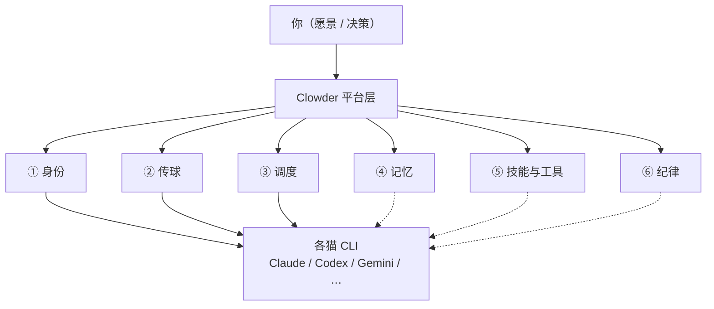
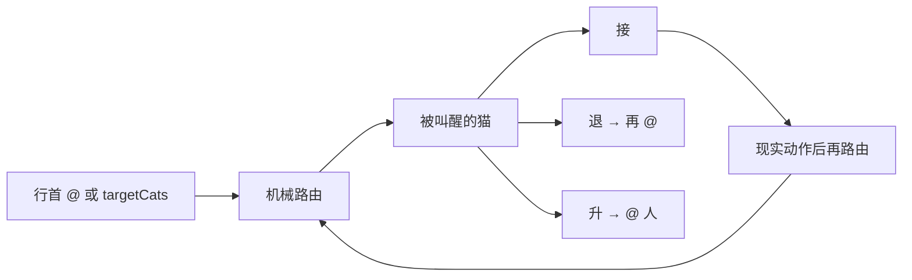
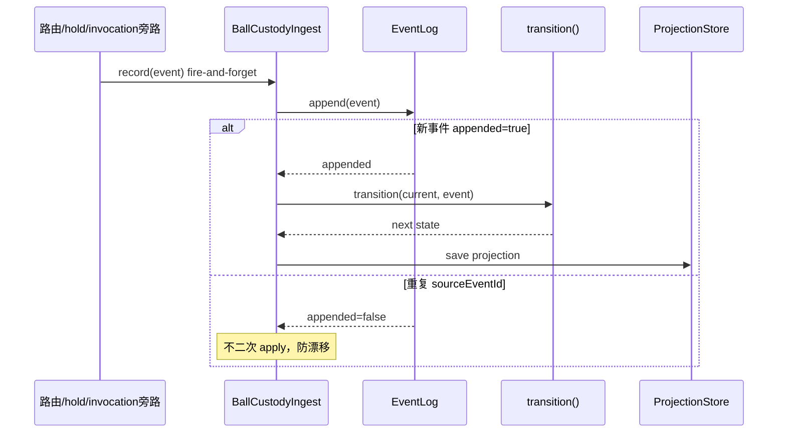
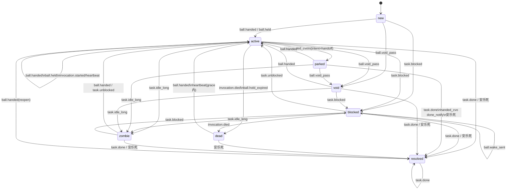

# Clowder 协作理解锚点

> **私人地图。** 聊天负责答疑，这里负责定锚。  
> **只收两样：** 能钉在脉络上的结论 · 当前卡点。  
> **不写：** 聊天原文、长教程、空壳章节。

### 怎么用

1. 先看 [总地图](#1-总地图)，点链路进脉络章  
2. 再看 [当前卡点](#2-当前卡点)——忘了聊到哪，看这里  
3. 深挖时进对应脉络章；主题多了会在章内再拆小节  

### 章节写法（固定三段式）

每个主题小节按这个顺序写——**不是**「实现在哪个 `.ts`、被谁 import」那种代码依赖，而是**机制在协作链路里站哪、解什么问题**：

1. **问题引出 / 系统位置**——从真实协作痛点问出来，落到本机制为什么存在、解决什么（能找到设计意图就写意图）  
2. **一句定锚**——用项目里的词说明机制是什么（球权、行首 `@`、`targetCats`、`hold_ball`…）；不用外部比喻  
3. **技术密度**——文件路径、常量、字段、状态/事件、实现顺序；够对照代码  

脉络章开头同样：先「整章在六脉里解什么问题」，再章级定锚，再链到主题小节。

### 防「用新概念解释概念」

抓重点用这条：**先只用读者已经听过的词把事说完，专有名词最后当标签贴上。**

| 做法 | 例 |
|------|-----|
| ✅ 旧词说完 → 括号标术语 | 「把流水账从头加一遍，得到一张『现在谁负责、什么状态』的快照——这张快照就叫投影」 |
| ❌ 术语套术语 | 「投影是事件溯源里对聚合的物化读模型」 |

本图已出现的「已知词」优先复用：球权、责任、谁该动手、流水账/事件列表、当前状态、持球人、叫醒、行首 `@`。新词首次出现必须带一句旧词释义。

### 入库规矩

| 情况 | 动作 |
|------|------|
| 钉住一条新理解 / 纠正误解 | 写入对应主题：问题引出 + 定锚 + 必要技术段 |
| 卡点变了 | 改写 §2（最多 3 条；懂了就删） |
| 冒出想挖的新题 | 只往 [待展开](#4-待展开) 加标题 |
| 以上都没有 | **本轮不改文件** |

### 三级结构（防糊墙）

```
总地图
  └─ 脉络章（固定 6 章）
        └─ 主题小节（按需才建）
```

- 不预建空主题节  
- 某章主题超过 ~5 个 → 先加**章内小地图**，再列小节  

---

## 1. 总地图

**问题引出：** 多个强模型各自能干活，但跨会话身份、跨猫交接、排队、共享记忆、流程门禁并不自带——缺了平台层，人就会变成「人肉路由器」。

**定锚：** Clowder 是模型与 Agent CLI 之上的平台层，负责身份、A2A 球权路由、调度排队、记忆检索与 SOP 纪律；推理与工具执行仍由各猫 CLI 完成。



**跳转：**  
[① 身份](#vein-identity) · [② 传球](#vein-pass) · [③ 调度](#vein-dispatch) · [④ 记忆](#vein-memory) · [⑤ 技能与工具](#vein-skills) · [⑥ 纪律](#vein-sop)

三层分工：

| 层 | 负责 | 不负责 |
|----|------|--------|
| 模型 | 推理、生成 | 长期记忆、团队纪律 |
| Agent CLI | 工具、文件、命令 | 跨猫球权、互审编排 |
| 平台（Clowder） | 身份、A2A 路由、排队、记忆、SOP | 替模型推理 |

---

## 2. 当前卡点

| # | 卡在哪 | 为什么卡 | 下一问可以问 |
|---|--------|----------|--------------|
| 1 | 投影=当前球权快照；已定「旧词优先」写法 | 防术语套术语 | 继续细问，或开调度 |
| 2 | 其它五脉只有章级框 | 尚未深挖 | 身份 / 调度 / 记忆 / … |

（懂了就删行；整表最多 3 条。）

---

## 3. 脉络章

<a id="vein-identity"></a>

### ① 身份 — 每只猫是谁

**问题引出：** 多 Agent 若每次都是匿名工具调用，就谈不上稳定角色、互审资格和跨 session 连续协作——先要回答「谁在说话、谁被叫到」。

**定锚：** 每只猫有稳定的 `catId` / roster 配置与会话绑定，跨 session 仍是同一身份，而不是一次性工具号。

*（尚无主题小节）* · [回总地图](#1-总地图)

---

<a id="vein-pass"></a>

### ② 传球 — A2A 球权与路由

**问题引出：** 多 Agent 同线程协作，必然涉及「下一条该谁处理」。若只靠人复制粘贴上下文，人或猫都会丢球。平台要在**不替模型猜意图**的前提下，把「叫醒谁 / 球在谁手里」变成可路由、可观测的动作——这就是 A2A（球权与路由）整章要解决的事。章内再拆：怎么从文本认出路由、没 `@` 怎么办、球丢了长啥样、短等待怎么持球。

**定锚：** 球权表示「此刻谁该对某个责任单元行动」；合法移交只有行首 `@` 文本路由或 MCP `targetCats`（及 multi_mention `targets`），接收方再决定接 / 退 / 升。

**章内跳转：** [传球大概](#pass-overview) · [@ 解析细则](#pass-mention-parse) · [回退梯](#pass-fallback) · [球权状态](#pass-dropped) · [hold_ball](#pass-hold) · [回总地图](#1-总地图)

<a id="pass-overview"></a>

#### 传球大概

**问题引出：** 有了「要传」的需求之后：消息怎么变成一次真实唤醒？平台若在路由层猜「用户本意」，既脆又和 LLM 能力重复。设计选择是——**代码只做机械叫醒；接 / 退 / 升留给被叫醒的猫**；并且「说了交给你」若没有系统动作，球权不能偷偷前进。

**定锚：** A2A 把「谁被叫醒」交给机械路由，把「接不接、退给谁、升给谁」交给被叫醒的猫；状态迁移须由现实动作产生，纯文字声明不算。



**技术密度**

| 出路 | 机制 | 代码锚 |
|------|------|--------|
| 文本路由 | 行首 `@handle` 解析成功 → 分发 | `a2a-mentions.ts` → `AgentRouter` / `route-serial` |
| 结构化路由 | MCP 发消息带 `targetCats`（或 `targets`） | `callback-tools` / `route-serial` |

流水线六层（`docs/architecture/at-mention-routing-system.md`）：

```
提及解析 → 目标解析(@→catId) → 无@则回退梯 → 分发调度
         → 上下文组装 → LLM 接/退/升
```

- 前 5 层：确定性代码；第 6 层：LLM 三选一  
- 「退」不是单独 API：再写行首 `@`，重新走提及解析  
- 真传球期望伴随 tool call / commit / review verdict 等；乒乓球与虚空传球针对声明与动作脱节  
- `hold_ball` 是有界持球例外，不是默认出口  
- 本层只决定**叫醒谁**；进队与 busy gate 属 [③ 调度](#vein-dispatch)

<a id="pass-mention-parse"></a>

#### @ 解析细则与交接上下文

**问题引出：** 文本里到处可能出现 `@`（邮箱、句中点名、代码块）。若全都当路由，会误叫醒；若没有任何结构化提示，被叫醒的猫也不知道「是点名交来的还是普通线程消息」。所以要两件事：**严格的可路由提及规则**，以及**调用侧注入交接字段**（不是在气泡里发明 XML tag）。

**定锚：** 文本路径只把「行首 `@` + mentionPatterns 命中」当成可路由提及；消息正文没有交接 XML tag，交接语义靠调用上下文字段注入 system prompt。

**实例：这句话到底在说什么**

「上下文字段」= 平台在**发起这次调用之前**填进 `InvocationContext` 的结构化字段（如 `directMessageFrom`），不是聊天气泡里的特殊标记。  
「注入 system prompt」= `SystemPromptBuilder` 把字段渲染成 prompt 文本，塞进本次 invoke 的系统侧提示，给**被叫醒的那只猫的 LLM**读。

分工：

| 步骤 | 谁做 | 要不要 LLM |
|------|------|------------|
| 解析行首 `@`、决定叫醒谁、写入 `directMessageFrom` 等 | 平台代码 | 否 |
| 渲染 D2/D4/D5 段进 system prompt | 平台代码 | 否 |
| 读到「Direct message from …；reply to …」后决定怎么回、是否再 `@` | 被叫醒的猫（LLM） | **是** |

例：缅因 `codex` 行首 `@opus` 把球传给布偶。串行路由里（`route-serial.ts`）会带上大致这样的上下文对象字段：

```ts
{
  catId: 'opus',                 // 被叫醒的是谁
  directMessageFrom: 'codex',    // A2A：前手是缅因（用户→猫时通常没有这个字段）
  mode: 'serial',
  chainIndex: 2,
  chainTotal: 2,
  a2aEnabled: true,
  // 可选：pingPongWarning / crossThreadReplyHint / teammates …
}
```

渲染进 prompt 后，布偶这次调用的系统侧会出现类似一行（测试断言同款）：

```text
Direct message from 缅因猫(codex) [model=…]; reply to 缅因猫(codex)
```

因此：交接的**路由与字段填充是系统内部**；交接的**语义理解与行为（回给谁、接/退/升）要靠 LLM 读这段 prompt**。没有字段时，猫仍能看见线程消息，但缺少机器保证的「这是点名交来的」提示。

**技术密度 — 解析**

文件：`packages/api/src/domains/cats/services/agents/routing/a2a-mentions.ts`

| 项 | 值 / 行为 |
|----|-----------|
| 单条目标上限 | `MAX_A2A_MENTION_TARGETS = 2` |
| 链深度（另一维度） | `getMaxA2ADepth()` → `MAX_A2A_DEPTH \|\| 15` |
| 行首规则 | F046：行首即路由，无需动作词；可带空白与 `>` / `-` / `1.` 前缀 |
| 句中 `@` | 不路由；影子检测（`InlineActionMention`）仅写侧反馈 |
| 匹配顺序 | `catRegistry.mentionPatterns`，**最长优先** |
| 边界 | `TOKEN_BOUNDARY_RE` / `HANDLE_CONTINUATION_RE` |
| 自提及 | 过滤；disabled → `routing_warnings` |
| 预处理（实现主路径） | 去掉围栏 `` ```...``` ``；可选行首空白修复 |

步骤：strip fence → 建 pattern 表 → 按行剥前缀 → 必须以 `@` 开头 → 最长匹配 + 边界 → 上限 2 停。

**技术密度 — 交接上下文**

叫醒仍靠行首 `@` 或 `targetCats`。被叫醒时 `SystemPromptBuilder` 注入：

| 字段 | Prompt 段 | 作用 |
|------|-----------|------|
| `directMessageFrom` | D2 | A2A 点名来源；优先回该猫 |
| 同族分身 | D3 | displayName 撞车时的分身提醒 |
| `crossThreadReplyHint` | D4 | `sourceThreadId` / `senderCatId` / 可选 `effectClass` |
| `pingPongWarning` | D5 | 同对连踢警告 |
| `teammates` / `mode` | D6/D7 | 队友与串行/并行 |

<a id="pass-fallback"></a>

#### 回退梯（本条无可路由 `@`）

**问题引出：** 人经常接话时不写 `@`（「看起来不错，合掉吧」）。若没有回退规则，要么静默没人醒，要么乱抓线程里最后发言的猫（系统 cross-post / 愿景守护也可能「最后发言」）。回退梯回答：**无显式路由时，按什么优先级仍能选出该叫醒谁**——且要符合「继续跟你刚才在跟的那只聊」。

**定锚：** 当本条消息没有可路由提及时，`AgentRouter` 按固定优先级选出目标猫；心智是延续最近的人↔猫对话，而不是「线程里谁最后发言」。

**技术密度**

文件：`AgentRouter.ts` → `peekTargets` / `findRecentUserMentionFallback`（F194）

1. **本条显式 mention**（含 `@all` / `@thread` 等）→ 直接用  
2. **`threadKind === 'concierge'`**：无本条 `@` 时固定 `preferredCats` 值班猫（不被历史 user mention 带走）  
3. **最近用户提及 fallback**  
   - 用户消息：`userId !== null && catId === null`  
   - 窗口：约 **5 条 user message** 或 **1 小时**  
   - 最近一条中的 routable mention → **单猫** deterministic fallback  
   - 不看猫消息  
4. **最后健康回复者**（`lastResponseHealthy !== false`）  
5. 偏好猫 / 任意健康参与者 / `getDefaultCatId()` 兜底  

**「最后发言的猫」和「最近一次对话的猫」可以不一致。**  
前者看线程时间线上谁最后开口（含猫↔猫 A2A、愿景守护 cross-post 等）；后者以**人的消息**为准（最近 user 消息里 `@` 过谁）。典型分叉：

| 时间线 | 线程最后发言 | 人最近在跟谁 | 你再不写 `@` 时优先叫醒谁 |
|--------|--------------|--------------|---------------------------|
| 你 `@布偶` → 布偶回 → 缅因因愿景守护/跨贴又发了一条 | 缅因 | 布偶（你上次 `@` 的） | **布偶**（用户提及 fallback 优先于最后回复者） |
| 布偶 `@缅因` review，缅因刚回完；你上一条 `@` 仍是布偶且在 1h/5 条窗内 | 缅因 | 仍可能是布偶（只看 user 消息里的 `@`） | **布偶**（窗内还能扫到那次 user `@`） |
| 窗内找不到带 `@` 的 user 消息 | （某只猫） | 含糊 | 才退到 **最后健康回复者** |

代码注释心智：`no @ = 继续刚才 @ 的猫里的一只`，**不是** `thread 里最近发言的猫`（F194；曾出现「明明 at 的是 47/55，却叫醒了 46」）。

**对偶缺口（已知张力）：** F194 把「用户提及」放在「最后回复者」之前，是为了挡住无关的最后发言（愿景守护 / cross-post）抢路由。但若链是：

`你 @Opus 写需求 → Opus @Codex 检视 → Codex 说没问题 → 你不写 @ 追问「废弃变量为啥没看出来」`

则窗内最近一次 **user `@` 仍是 Opus**，回退会优先叫醒 **Opus**，而不是刚做完检视的 **Codex**。  
人的心智更像 F078「接着跟刚聊完/刚干活的那只」；现行实现在「防抢路由」和「A2A 后追问审稿猫」之间偏了前者。  
（球权账本里球可能已在 Codex；**叫醒谁**仍走上述回退梯——两件事不要混。）

<a id="pass-dropped"></a>

#### 球权状态（掉球与保管链）

**问题引出：** 「谁该接着对这件事负责」若只等于「谁正在说话」，会漏掉：hold 等待中、球晾在人手里、调用已死但名义还在、嘴上说传了系统没动。需要独立于发言流的球权模型，回答责任在谁、形态是否异常。

**定锚：** 球权 = **谁该对某个责任单元行动**（`holder` + `BallState`），不是「谁正在发言」。发言/invoke 是执行动作；球权是责任归属的可观测账本。

**球权 ≠ 正在发言**

| | 球权（ball custody） | 发言 / invocation |
|--|----------------------|-------------------|
| 问的是 | 责任现在算谁的、形态是否健康 | 这一刻谁在被调用、谁在吐字 |
| 可以有球但不发言 | 有：`hold_ball` 等待、`parked` 等人、`blocked` 等探针 | — |
| 可以发言但不是「持球推进」 | 有：愿景守护 cross-post、FYI 知会 | 最后发言者 ≠ 持球者（前面回退缺口即一例） |
| 真相源 | `BallCustodyEventLog` + 投影 | 消息流 / InvocationTracker |

**状态怎么维护（事件溯源，非直接改状态字段）**

```
现有系统动作（路由投递 / hold / invocation 终态 / task 变更…）
    → fire-and-forget BallCustodyIngest.record(event)
    → EventLog.append（append-only；同 sourceEventId 幂等）
    → 若 appended:true → Projector.apply
         → transition(current, event) 纯函数状态机
         → 写 ProjectionStore（可 rebuild=整段 replay）
```

- 账本唯一真相：`BallCustodyEventLog`；投影可重建，禁止第二套 canonical  
- ingest 失败只 log，不堵主流程（观测优先，非账务强一致）  
- 唤醒投递在 ProbeScheduler/WakeSender，**不**放进 projector（rebuild 安全）

**维护时序（UML 序列图）**



**状态机（UML 状态图，主路径精简）**



**技术密度**

| 锚 | 路径 |
|----|------|
| Cell | `ball-custody`（F233） |
| 类型 | `packages/shared/src/types/ball-custody.ts` |
| 状态机 | `ball-custody-state-machine.ts`（纯函数，零 IO） |
| 写入 | `BallCustodyIngest.ts` |
| subjectKey | `ball:thread:{id}` / `ball:task:{id}` |

**「账本」和「投影」——先用旧词**

球权要同时满足两件事：

1. **事后能查清发生过什么** → 需要一份只往上加、不改历史的记录（交出去、hold、调用挂了…）  
2. **现在要一眼看到谁负责、什么状态** → 若每次都从头把整份记录加一遍太慢，所以另存一张「算到现在」的结果表  

| 人话 | 文档里的标签 | 对应类 |
|------|--------------|--------|
| 只追加的历史流水（发生过什么） | 常称**账本** / EventLog | `RedisBallCustodyEventLog` |
| 「算到现在」的结果：谁持球、哪一态 | 常称**投影** / Projection | `BallCustodyProjector` 算出来，存进 `RedisBallCustodyProjectionStore` |

所以：**投影 = 根据历史流水算出来、并缓存下来的「当前球权快照」**（里面有 `holder`、`state`、`heldUntil` 等）。  
值班简报读的是这张快照；快照坏了或要核对，可以把流水从头重放再算一遍（rebuild）。

不是：另有一套人改的「权威当前表」。权威历史在流水里；快照可以丢了重算。

球权**没有**单一 `BallManager`，分工在 `packages/api/src/domains/ball-custody/`：

| 类 / 模块 | 人话 |
|-----------|------|
| `ball-custody-events.ts` | 把系统动作写成一条流水记录 |
| `BallCustodyIngest` | 写入入口：先记流水，新记录才更新快照 |
| `RedisBallCustodyEventLog` | 存历史流水 |
| `transition()` | 已知「当前态 + 新记录」→ 下一态 |
| `BallCustodyProjector` | 更新快照（holder/state 等） |
| `RedisBallCustodyProjectionStore` | 存快照 |
| `ProbeScheduler` / `WakeSender` | 该叫醒谁时去叫醒（不写进快照逻辑里） |

路由等只旁路调用 `ingest.record`，自己不改球权快照。

`BallState`：`new` → `active` | `blocked` | `parked` | `dead` | `void` | `zombie` | `resolved`

| 状态 | 含义 | 典型事件 |
|------|------|----------|
| active | 正常推进；hold 中常仍 active + `heldUntil` | `ball.handed`、`ball.held`、`invocation.*` |
| void | 声明传球但无系统动作 | `ball.void_pass` |
| dead | invocation 死或 hold 到期匹配 | `invocation.died`；`ball.hold_expired` |
| blocked | task 阻塞等探针 | `task.blocked`；`ball.wake_sent`（不改态） |
| parked | 球到 cvo/人晾着 | `ball.handed_cvo` + `intent=handoff` |
| zombie | 长期 idle | `task.idle_long` |
| resolved | 完成或安乐死 | `task.done`；`ball.frozen/degraded/abandoned` |

`handed_cvo` intent：`handoff→parked`，`done_notify→resolved`，`fyi` 不改态。  
`DEAD_BALL_ZOMBIE_GRACE_MS = 600_000`。简报读 projection，异常优先。

<a id="pass-hold"></a>

#### hold_ball

**问题引出：** 有时球仍属于当前猫，但必须短等一个**外部、可预期**条件（如远端 CI），此时既不该空传给别人，也不能结束回合后永远没人再叫醒你。`hold_ball` 回答：如何**有界持球并预约一次自动再调用**——同时防止「我想想也 hold」、防止和已有自动回调叠床架屋。

**定锚：** `cat_cafe_hold_ball` 是有界持球：当前猫保持球权，调度一次 `wakeAfterMs` 后的自动再调用；例外出口，默认仍应行首 `@` 或 `targetCats` 传球。

**技术密度**

定义：`packages/mcp-server/src/tools/callback-tools.ts` → `cat_cafe_hold_ball`

| 入参 | 约束 |
|------|------|
| `reason` | 为何持球 |
| `nextStep` | 唤醒后做什么 |
| `wakeAfterMs` | `5000…3600000`（5s–1h） |

- 约 1h 内同 `(thread, cat)` 大约最多 3 次；第 4 次 429 → 必须传球  
- **单槽**：再 hold 替换未完成的前一次 wake（KD-23）  
- 仅用于 harness 不可见、不会自动回调的外部等待  
- 纯文本「我 hold」不算 → `void-hold-detect`  
- 状态机：`ball.held` → 常仍 `active` + `heldUntil`；匹配 `hold_expired` → `dead`  

---

<a id="vein-dispatch"></a>

### ③ 调度 — 怎么叫醒、会不会撞车

**问题引出：** 路由已经决定「该叫醒谁」，但同一只猫可能正忙、多来源（用户、A2A、连接器、定时）会抢同一执行槽。若没有统一排队与分层 busy gate，就会插队、饿死或重复 invoke——调度回答「叫醒如何落地为有序执行」。

**定锚：** 目标猫确定后，调用进入 `InvocationQueue`；用户消息、连接器唤醒、A2A 续传等来源的 busy gate / 优先级分层不同（F175 / F185）。

*（尚无主题小节）* · [回总地图](#1-总地图)

---

<a id="vein-memory"></a>

### ④ 记忆 — 证据与检索

**问题引出：** 每次 invoke 上下文有限且会压缩；团队决策与教训若只活在对话里，换 session 就丢。记忆回答：如何把可追溯材料变成可检索证据，供猫按需取用。

**定锚：** 可检索的证据库（evidence）承载跨会话知识；猫按需经检索接口取用，而不是每次靠全文重讲。

*（尚无主题小节）* · [回总地图](#1-总地图)

---

<a id="vein-skills"></a>

### ⑤ 技能与工具 — Skills 与 MCP

**问题引出：** 平台能力与做事流程若全塞进常驻 prompt，会又胖又难演进；若各猫各接一套工具，协作面分裂。Skills / MCP 回答：流程说明书如何按需加载、工具如何经统一回调面共享。

**定锚：** Skills 是按需加载的流程说明书（manifest）；MCP 是跨猫共用的工具回调面。

*（尚无主题小节）* · [回总地图](#1-总地图)

---

<a id="vein-sop"></a>

### ⑥ 纪律 — SOP 与门禁

**问题引出：** 多猫能传能写，仍可能跳过设计确认、自我放行合并、或做完却偏离愿景。SOP / 门禁回答：协作如何按台阶推进并强制跨模型互审与愿景核对。

**定锚：** 开发按 SOP 台阶推进（Design Gate → impl → quality-gate → review → merge-gate → 愿景守护）；跨模型互审降低自我放行。

*（尚无主题小节）* · [回总地图](#1-总地图)

---

## 4. 待展开

只列标题，点名再挖。禁止在本节写正文。

- [x] ② 传球：大概 → [传球大概](#pass-overview)
- [x] ② 传球：`@` 解析 + 交接上下文 → [@ 解析细则](#pass-mention-parse)
- [x] ② 传球：回退梯 → [回退梯](#pass-fallback)
- [x] ② 传球：球权状态 → [球权状态](#pass-dropped)
- [x] ② 传球：`hold_ball` → [hold_ball](#pass-hold)
- [ ] ③ 调度：InvocationQueue / busy gate / 优先级
- [ ] ① 身份：roster / 会话绑定
- [ ] ④ 记忆：索引与检索路径
- [ ] ⑤ Skills / MCP 一次调用链路
- [ ] ⑥ SOP 五步与门禁

---

## 修订记录

| 日期 | 改了什么 |
|------|----------|
| 2026-07-27 | 首版：总地图 + 六脉定锚 + 卡点 + 待展开 |
| 2026-07-27 | ② 传球：大概 / @解析 / 回退梯 / 掉球 / hold_ball |
| 2026-07-28 | 「一句定锚 + 技术密度」；去掉外部比喻 |
| 2026-07-28 | 升级为三段式：问题引出 → 定锚 → 技术密度 |
| 2026-07-28 | @解析节补「上下文字段注入」实例 |
| 2026-07-28 | 回退梯补：最后发言 vs 最近对话可分叉 |
| 2026-07-28 | 回退梯补对偶缺口：A2A 后无@追问可能仍打到旧 user @ |
| 2026-07-28 | 球权节：定义≠发言；事件溯源；状态机+序列 UML |
| 2026-07-28 | 球权节：账本=EventLog；类职责表 |
| 2026-07-29 | 投影=当前快照（旧词先说）；文首加「防新概念套概念」规矩 |
