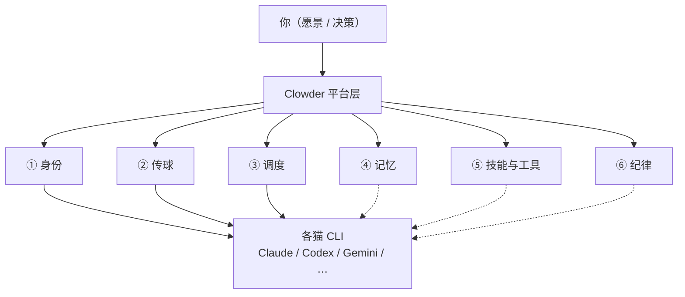
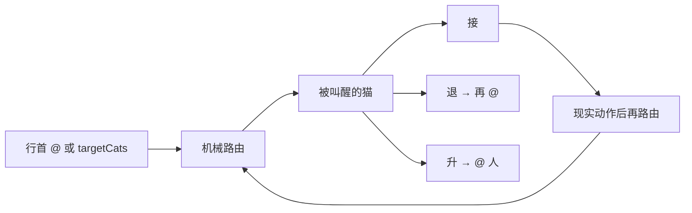

# Clowder 协作理解锚点

> **私人地图。** 聊天负责答疑，这里负责定锚。  
> **只收两样：** 能钉在脉络上的结论 · 当前卡点。  
> **不写：** 聊天原文、长教程、空壳章节。

### 怎么用

1. 先看 [总地图](#1-总地图)，点链路进脉络章  
2. 再看 [当前卡点](#2-当前卡点)——忘了聊到哪，看这里  
3. 深挖时进对应脉络章；主题多了会在章内再拆小节  

### 章节写法（固定两段式）

每个主题小节：

1. **先一句定锚**——用项目里的词（球权、行首 `@`、`targetCats`、`hold_ball`、InvocationQueue…），说明机制是什么；不用外部比喻  
2. **再写技术密度**——文件路径、常量、字段、状态/事件、实现顺序；够对照代码

### 入库规矩

| 情况 | 动作 |
|------|------|
| 钉住一条新理解 / 纠正误解 | 写入对应主题：一句定锚 + 必要技术段；需要时补图 |
| 卡点变了 | 改写 §2（最多 3 条；懂了就删） |
| 冒出想挖的新题 | 只往 [待展开](#4-待展开) 加标题 |
| 以上都没有 | **本轮不改文件** |

### 三级结构（防糊墙）

```
总地图
  └─ 脉络章（固定 6 章，对应地图节点）
        └─ 主题小节（按需才建：钉过结论或点名要展开）
```

- 不预建空主题节  
- 某章主题超过 ~5 个 → 先加**章内小地图**，再列小节  

---

## 1. 总地图

**定锚：** Clowder 是模型与 Agent CLI 之上的平台层，负责身份、A2A 球权路由、调度排队、记忆检索与 SOP 纪律；推理与工具执行仍由各猫 CLI 完成。



**跳转：**  
[① 身份](#vein-identity) · [② 传球](#vein-pass) · [③ 调度](#vein-dispatch) · [④ 记忆](#vein-memory) · [⑤ 技能与工具](#vein-skills) · [⑥ 纪律](#vein-sop)

三层分工：

| 层 | 负责 | 不负责 |
|----|------|--------|
| 模型 | 推理、生成 | 长期记忆、团队纪律 |
| Agent CLI | 工具、文件、命令 | 跨猫球权、互审编排 |
| 平台（Clowder） | 身份、A2A 路由、排队、记忆、SOP | 替模型推理 |

---

## 2. 当前卡点

| # | 卡在哪 | 为什么卡 | 下一问可以问 |
|---|--------|----------|--------------|
| 1 | 传球章已按「一句定锚 + 技术密度」重写 | 结构约定刚落地 | 密度/定锚句是否还要改；或开 **③ 调度** |
| 2 | 其它五脉仍只有章级定锚 | 尚未点名深挖 | 身份 / 调度 / 记忆 / … |

（懂了就删行；整表最多 3 条。）

---

## 3. 脉络章

<a id="vein-identity"></a>

### ① 身份 — 每只猫是谁

**定锚：** 每只猫有稳定的 `catId` / roster 配置与会话绑定，跨 session 仍是同一身份，而不是一次性工具号。

*（尚无主题小节）* · [回总地图](#1-总地图)

---

<a id="vein-pass"></a>

### ② 传球 — A2A 球权与路由

**定锚：** 球权表示「此刻谁该对某个责任单元行动」；合法移交只有行首 `@` 文本路由或 MCP `targetCats`（及 multi_mention `targets`），接收方再决定接 / 退 / 升。

**章内跳转：** [传球大概](#pass-overview) · [@ 解析细则](#pass-mention-parse) · [回退梯](#pass-fallback) · [球权状态](#pass-dropped) · [hold_ball](#pass-hold) · [回总地图](#1-总地图)

<a id="pass-overview"></a>

#### 传球大概

**定锚：** A2A 把「谁被叫醒」交给机械路由，把「接不接、退给谁、升给谁」交给被叫醒的猫；状态迁移须由现实动作产生，纯文字声明不算。



**技术密度**

| 出路 | 机制 | 代码锚 |
|------|------|--------|
| 文本路由 | 行首 `@handle` 解析成功 → 分发 | `a2a-mentions.ts` → `AgentRouter` / `route-serial` |
| 结构化路由 | MCP 发消息带 `targetCats`（或 `targets`） | `callback-tools` / `route-serial` |

流水线六层（`docs/architecture/at-mention-routing-system.md`）：

```
提及解析 → 目标解析(@→catId) → 无@则回退梯 → 分发调度
         → 上下文组装 → LLM 接/退/升
```

- 前 5 层：确定性代码；第 6 层：LLM 三选一  
- 「退」不是单独 API：再写行首 `@`，重新走提及解析  
- 真传球期望伴随 tool call / commit / review verdict 等；乒乓球与虚空传球检测针对「声明与动作脱节」  
- `hold_ball` 是有界持球例外，不是默认出口（见下节）  
- 解析/回退只决定**叫醒谁**；进队与 busy gate 属 [③ 调度](#vein-dispatch)

<a id="pass-mention-parse"></a>

#### @ 解析细则与交接上下文

**定锚：** 文本路径只把「行首 `@` + mentionPatterns 命中」当成可路由提及；消息正文没有交接 XML tag，交接语义靠调用上下文字段注入 system prompt。

**技术密度 — 解析**

文件：`packages/api/src/domains/cats/services/agents/routing/a2a-mentions.ts`

| 项 | 值 / 行为 |
|----|-----------|
| 单条目标上限 | `MAX_A2A_MENTION_TARGETS = 2` |
| 链深度（另一维度） | `getMaxA2ADepth()` → `MAX_A2A_DEPTH \|\| 15` |
| 行首规则 | F046：行首即路由，无需动作词；可带空白与 `>` / `-` / `1.` 前缀 |
| 句中 `@` | 不路由；影子检测（`InlineActionMention`）仅写侧反馈 |
| 匹配顺序 | `catRegistry.mentionPatterns`，**最长优先**（防 `@opus` 吃 `@opus-48`） |
| 边界 | `TOKEN_BOUNDARY_RE` / `HANDLE_CONTINUATION_RE` |
| 自提及 | 过滤；disabled 猫 → `routing_warnings`，不进 `mentions` |
| 预处理（实现主路径） | 去掉围栏 `` ```...``` ``；可选行首空白修复 |

步骤：strip fence → 建 pattern 表 → 按行剥前缀 → 必须以 `@` 开头 → 最长匹配 + 边界 → 上限 2 停。

**技术密度 — 交接上下文**

叫醒仍靠行首 `@` 或 `targetCats`。被叫醒时 `SystemPromptBuilder` 注入：

| 字段 | Prompt 段 | 作用 |
|------|-----------|------|
| `directMessageFrom` | D2 | A2A 点名来源；优先回该猫（`d2-direct-message.md`） |
| 同族分身 | D3 | displayName 撞车时的分身提醒 |
| `crossThreadReplyHint` | D4 | `sourceThreadId` / `senderCatId` / 可选 `effectClass` |
| `pingPongWarning` | D5 | 同对连踢警告 |
| `teammates` / `mode` | D6/D7 | 队友与串行/并行 |

这些是结构化 hydration → prompt 文本，不是消息内 tag。

<a id="pass-fallback"></a>

#### 回退梯（本条无可路由 `@`）

**定锚：** 当本条消息没有可路由提及时，`AgentRouter` 按固定优先级选出一只（或一组）目标猫，心智是「继续跟你刚才在跟的那只聊」，而不是「线程里谁最后发言」。

**技术密度**

文件：`AgentRouter.ts` → `peekTargets` / `findRecentUserMentionFallback`（F194）

实现顺序：

1. **本条显式 mention**（含 `@all` / `@thread` 等展开）→ 直接用  
2. **`threadKind === 'concierge'`**：无本条 `@` 时固定 `preferredCats` 值班猫（不被历史 user mention 带走）  
3. **最近用户提及 fallback**  
   - 用户消息定义：`userId !== null && catId === null`  
   - 窗口：约 **5 条 user message** 或 **1 小时**  
   - 取最近一条中的 routable mention → **单猫** deterministic fallback  
   - 不看猫消息（防愿景守护 / 跨贴抢路由）  
4. **最后健康回复者**（`participantsWithActivity`，`lastResponseHealthy !== false`）  
5. 偏好猫 / 任意健康参与者 / `getDefaultCatId()` 兜底  

<a id="pass-dropped"></a>

#### 球权状态（掉球与保管链）

**定锚：** 球权以 `ball-custody` 事件流为账本、投影为可读状态；异常形态（void / dead / parked / zombie…）由事件转移产生，不以扫聊天推断为真相源。

**技术密度**

| 锚 | 路径 |
|----|------|
| Cell | `docs/architecture/ownership/cells/ball-custody.md`（F233） |
| 类型 | `packages/shared/src/types/ball-custody.ts` |
| 状态机 | `ball-custody-state-machine.ts`（纯函数表驱动，零 IO） |
| subjectKey | `ball:thread:{id}` / `ball:task:{id}`（不另造球 ID） |

`BallState`：`new` → `active` | `blocked` | `parked` | `dead` | `void` | `zombie` | `resolved`

| 状态 | 含义 | 典型事件 |
|------|------|----------|
| active | 正常推进；hold 中常仍为 active，另有 `heldUntil` | `ball.handed`、`ball.held`、`invocation.started/heartbeat` |
| void | 声明传球但无系统动作 | `ball.void_pass` |
| dead | invocation 死亡或 hold 到期且匹配 | `invocation.died`；`ball.hold_expired`（须 `fireAt === heldUntil`） |
| blocked | task 阻塞等探针 | `task.blocked`；`ball.wake_sent`（informational，不改态） |
| parked | 球到 cvo/人手上晾着 | `ball.handed_cvo` 且 `intent=handoff` |
| zombie | 长期 idle | `task.idle_long` |
| resolved | 完成或安乐死 | `task.done`；`ball.frozen/degraded/abandoned` |

`handed_cvo` 的 `intent`：`handoff→parked`，`done_notify→resolved`，`fyi` 不改态。  
死球迟到心跳 grace：`DEAD_BALL_ZOMBIE_GRACE_MS = 600_000`。  
值班简报读 projection，异常优先。

<a id="pass-hold"></a>

#### hold_ball

**定锚：** `cat_cafe_hold_ball` 是有界持球：当前猫保持球权，调度一次 `wakeAfterMs` 后的自动再调用；它是例外出口，默认仍应行首 `@` 或 `targetCats` 传球。

**技术密度**

定义：`packages/mcp-server/src/tools/callback-tools.ts` → `cat_cafe_hold_ball`

| 入参 | 约束 |
|------|------|
| `reason` | 为何持球 |
| `nextStep` | 唤醒后做什么 |
| `wakeAfterMs` | `5000…3600000`（5s–1h） |

GOTCHA（工具描述）：

- 滚动约 1h 内同 `(thread, cat)` 大约最多 3 次；第 4 次 429 → 必须传球  
- **单槽**：再 hold 替换未完成的前一次 wake（KD-23）  
- 仅用于 harness 不可见、不会自动回调的外部等待；已跟踪后台任务完成会自行再 invoke 时不要叠 hold  
- 纯文本「我 hold」不算：`void-hold-detect` 抓声明无 tool call  

状态机：`ball.held` 多从 `new/active` → 仍 `active`（projector 写 `heldUntil`）；匹配的 `hold_expired` → `dead`。

---

<a id="vein-dispatch"></a>

### ③ 调度 — 怎么叫醒、会不会撞车

**定锚：** 目标猫确定后，调用进入 `InvocationQueue`；用户消息、连接器唤醒、A2A 续传等来源的 busy gate / 优先级分层不同（F175 / F185），避免乱插队或饿死某类任务。

*（尚无主题小节）* · [回总地图](#1-总地图)

---

<a id="vein-memory"></a>

### ④ 记忆 — 证据与检索

**定锚：** 对话会压缩、会话会断；可检索的证据库（evidence）承载跨会话知识，猫按需 `search_evidence` 等接口取用，而不是每次靠全文重讲。

*（尚无主题小节）* · [回总地图](#1-总地图)

---

<a id="vein-skills"></a>

### ⑤ 技能与工具 — Skills 与 MCP

**定锚：** Skills 是按需加载的流程说明书（manifest）；MCP 是跨猫共用的工具回调面，平台能力经 MCP / callback 暴露给各 CLI。

*（尚无主题小节）* · [回总地图](#1-总地图)

---

<a id="vein-sop"></a>

### ⑥ 纪律 — SOP 与门禁

**定锚：** 开发按 SOP 台阶推进（Design Gate → impl → quality-gate → review → merge-gate → 愿景守护）；跨模型互审降低自我放行。

*（尚无主题小节）* · [回总地图](#1-总地图)

---

## 4. 待展开

只列标题，点名再挖。禁止在本节写正文。

- [x] ② 传球：大概 → [传球大概](#pass-overview)
- [x] ② 传球：`@` 解析 + 交接上下文 → [@ 解析细则](#pass-mention-parse)
- [x] ② 传球：回退梯 → [回退梯](#pass-fallback)
- [x] ② 传球：球权状态 → [球权状态](#pass-dropped)
- [x] ② 传球：`hold_ball` → [hold_ball](#pass-hold)
- [ ] ③ 调度：InvocationQueue / busy gate / 优先级
- [ ] ① 身份：roster / 会话绑定
- [ ] ④ 记忆：索引与检索路径
- [ ] ⑤ Skills / MCP 一次调用链路
- [ ] ⑥ SOP 五步与门禁

---

## 修订记录

| 日期 | 改了什么 |
|------|----------|
| 2026-07-27 | 首版：总地图 + 六脉定锚 + 卡点 + 待展开 |
| 2026-07-27 | ② 传球：大概 / @解析 / 回退梯 / 掉球 / hold_ball |
| 2026-07-28 | 约定「一句项目概念定锚 + 技术密度」；按此重写传球章与章级定锚；去掉外部比喻 |
