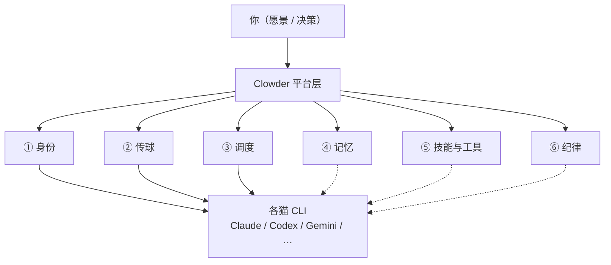
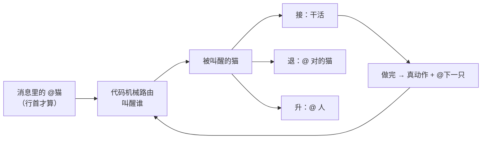

# Clowder 协作理解锚点

> **私人地图。** 聊天负责答疑，这里负责定锚。  
> **只收两样：** 能钉在脉络上的结论 · 当前卡点。  
> **不写：** 聊天原文、长教程、空壳章节。

### 怎么用

1. 先看 [总地图](#1-总地图)，点链路进脉络章  
2. 再看 [当前卡点](#2-当前卡点)——忘了聊到哪，看这里  
3. 深挖时进对应脉络章；主题多了会在章内再拆小节  

### 入库规矩

| 情况 | 动作 |
|------|------|
| 钉住一条新理解 / 纠正误解 | 写入对应脉络章（≤2 句）；需要时补小图 |
| 卡点变了 | 改写 §2（最多 3 条；懂了就删） |
| 冒出想挖的新题 | 只往 [待展开](#4-待展开) 加标题 |
| 以上都没有 | **本轮不改文件** |

### 三级结构（防糊墙）

```
总地图
  └─ 脉络章（固定 6 章，对应地图节点）
        └─ 主题小节（按需才建：钉过结论或点名要展开）
```

- 不预建空主题节  
- 某章主题超过 ~5 个 → 先加**章内小地图**，再列小节  

---

## 1. 总地图

一句话：Clowder 不替猫思考，只给它们当团队的办公室——谁是谁、球给谁、怎么排队、记什么、按什么规矩干。



**跳转（渲染器若不支持图内点击，用这行）：**  
[① 身份](#vein-identity) · [② 传球](#vein-pass) · [③ 调度](#vein-dispatch) · [④ 记忆](#vein-memory) · [⑤ 技能与工具](#vein-skills) · [⑥ 纪律](#vein-sop)

三层分工（背景，不单独成章）：

| 层 | 白话 | 干什么 |
|----|------|--------|
| 模型 | 脑子 | 推理、生成 |
| Agent CLI | 手脚 | 改文件、跑命令、用工具 |
| 平台（Clowder） | 办公室 | 身份、传话、排队、记忆、门禁 |

---

## 2. 当前卡点

| # | 卡在哪 | 为什么卡 | 下一问可以问 |
|---|--------|----------|--------------|
| 1 | 传球章已较完整 | 回退梯 / 掉球 / hold 已钉 | 换下一条脉络？或追问某一形态的代码细节 |
| 2 | 其它五脉仍只一句 | 尚未点名 | 建议下一条：**调度**（排队怎么接住传球） |

（懂了就删行；整表最多 3 条。）

---

## 3. 脉络章

<a id="vein-identity"></a>

### ① 身份 — 每只猫是谁

**定锚：** 不是临时工具号，是长期队友——有名字、性格、角色；跨会话也还是「同一只猫」。

*（尚无主题小节）* · [回总地图](#1-总地图)

---

<a id="vein-pass"></a>

### ② 传球 — 谁该接着干

**定锚：** 球权 = 此刻该谁动手；`@猫` 是路由指令（叫醒谁），不只是聊天提醒。猫也可以把球传给另一只猫。

**章内跳转：** [传球大概](#pass-overview) · [@ 解析细则](#pass-mention-parse) · [回退梯](#pass-fallback) · [球掉了](#pass-dropped) · [hold_ball](#pass-hold) · [回总地图](#1-总地图)

<a id="pass-overview"></a>

#### 传球大概



**已钉：**

1. **球 = 责任**：谁持球，谁该接着动；传球靠行首 `@`，不是普通@提醒。
2. **两层分工**：代码只负责「机械叫醒」；接不接、退给谁、升给人——交给被叫醒的猫自己判断。
3. **真传球要有现实动作**：光说「交给你了」不算；要有工具调用 / 提交 / review 结论等，再 `@` 下一只。纯文字来回踢 = 乒乓球，系统会熔断提醒。
4. **旁路**：等外部条件时可以 `hold_ball`（先把球按住），条件到了再唤醒续接——细节待展开。
5. **两条合法出路**：行首文本 `@` **或** MCP 结构化字段 `targetCats`（发消息工具里点名）；句中 `@` 不算路由。

*文档锚：`docs/architecture/at-mention-routing-system.md` · 架构图「A2A 球权流转」*

<a id="pass-mention-parse"></a>

#### @ 解析细则

**为啥必须行首？**  
早期试过「句中 + 动作词」（请让 @xxx…）→ 误报多、歧义大。现行约定：**想叫醒谁，就把 `@handle` 放行首**（行前空格、`>`、`-`、`1.` 等 markdown 前缀可以）。句中只当普通文字；另外有「影子检测」可提醒写错了，但**不拿来路由**。

**一次最多几只？**  
`MAX_A2A_MENTION_TARGETS = 2`——单条消息最多叫醒 **2 只不同的猫**（安全阀，防一把扇出去太多）。

**解析怎么走（代码白话）：**  
文件：`packages/api/.../routing/a2a-mentions.ts`

```
去掉 ```代码块```
  → 从花名册取出每只猫的 mentionPatterns（最长优先，防 @opus 吃掉 @opus-48）
  → 按行扫：去掉行首空白/列表前缀后，必须以 @ 开头
  → 匹配 pattern + 词边界（避免邮箱、半截名字）
  → 过滤自己；猫禁用则记警告、不叫醒
  → 凑满 2 只就停
```

**交接有没有单独 tag？**  
消息正文里**没有**特殊 XML/标签协议；叫醒仍靠行首 `@` 或 MCP `targetCats`。  
被叫醒时，平台往 **调用上下文 / system prompt** 里注入结构化字段（不是聊天气泡里的 tag），常见：

| 字段 | 白话 |
|------|------|
| `directMessageFrom` | 「这是猫 X 点名叫你的，优先回 X」 |
| `crossThreadReplyHint` | 跨线程来的球：从哪来、谁发的、效果类型 |
| `pingPongWarning` | 俩猫来回踢太多次了，别再空传 |
| `teammates` / `mode` | 这次还有谁、串行还是并行 |

*代码锚：`SystemPromptBuilder` 的 D2/D4/D5 段；模板如 `assets/prompt-templates/d2-direct-message.md`*

<a id="pass-fallback"></a>

#### 回退梯（消息里没有 @ 时）

人常说「看起来不错，合掉吧」却不写 `@`。系统按优先级猜该叫醒谁（`AgentRouter.peekTargets`）：

```
① 本条有显式 @ / @all 之类     → 用它
② 最近几条「人」的消息里 @ 过谁 → 继续找那只（只看用户消息，防猫系统消息抢路由）
③ 线程里最后健康回复的那只猫   → 「没 @ = 接着跟刚才那只聊」
④ 线程偏好猫 / 系统默认猫       → 兜底
```

特例：前台接待线程（concierge）无 `@` 时固定找值班猫，不被「上次 @ 过谁」带走。

<a id="pass-dropped"></a>

#### 球掉了长啥样

球权有一本账（`ball-custody`）：事件流 + 投影状态。人话形态：

| 形态 | 白话 | 典型怎么来的 |
|------|------|--------------|
| **活着 active** | 有人正经推着 | 行首 `@` 投递、正常干活；hold 中也算在 active（带着到期时间） |
| **虚空 void** | 嘴上说传了，系统没动作 | 说了「交给你」但无行首 `@` / 无 `targetCats` / 无 hold |
| **死球 dead** | 持球的那次调用挂了 | 崩了、额度没了、超时；或 hold 到期没人续 |
| **阻塞 blocked** | 等外部条件 | 任务卡住等探针；条件到了可能完结，或弹回持有者再叫醒 |
| **搁置 parked** | 球到了人手里晾着 | `@` 了共创者/operator，人忘了 |
| **僵尸 zombie** | 心里不做了但没明说杀 | 长期无活动、也没正式关掉 |
| **了结 resolved** | 正常做完或正式放弃 | task 完成；或冷冻/降级/放弃（安乐死） |

值班简报优先甩异常球（晾着的、死的、虚空的），正常推进的活球往往只报个数。

<a id="pass-hold"></a>

#### hold_ball（先按住，稍后再叫醒我）

**是什么：** MCP 工具 `cat_cafe_hold_ball`——球还是你的，但先睡一小会儿；系统到期自动再叫醒你，并带上你写的「为什么按住 / 醒了干什么」。

**何时用：** 球明确是你的 + 别人帮不上 + **短、可预期**的外部等待（如 CI、远端检查）。  
**何时不用：** 该 review → `@` 审的人；该别人干 → `@` 那只；「我想想」≠ hold；结论写完必须传出去，不能 hold 当终点。

**硬规矩（白话）：**
- 要调工具才算数；光说「我 hold」→ 虚空持球，系统会提醒
- 约 1 小时内同一线程同一猫最多 hold 约 3 次，再多必须传球
- 同一线程同一猫同时只挂 **一个** hold；再调会顶掉旧的
- 默认出口仍是 `@` 某人；hold 是例外，不是常态

---

<a id="vein-dispatch"></a>

### ③ 调度 — 怎么叫醒、会不会撞车

**定锚：** 活进统一排队再叫猫；用户喊、外部消息、猫互传，插队规则不一样，避免乱撞或饿死某类任务。

*（尚无主题小节）* · [回总地图](#1-总地图)

---

<a id="vein-memory"></a>

### ④ 记忆 — 团队共用书架

**定锚：** 对话会丢、会话会断；证据 / 教训 / 决策进可检索的书架，需要时再查，而不是每次从头讲。

*（尚无主题小节）* · [回总地图](#1-总地图)

---

<a id="vein-skills"></a>

### ⑤ 技能与工具 — 说明书和工具箱

**定锚：** Skills = 按需加载的做事说明书；MCP = 共用工具接口，让不同猫都能回调平台能力。

*（尚无主题小节）* · [回总地图](#1-总地图)

---

<a id="vein-sop"></a>

### ⑥ 纪律 — 怎么一起把事做完

**定锚：** 固定台阶推进（设计确认 → 实现 → 自检 → 互审 → 合并 → 愿景守护）；尽量跨模型互审，少「自己夸自己」。

*（尚无主题小节）* · [回总地图](#1-总地图)

---

## 4. 待展开

只列标题，点名再挖。禁止在本节写正文。

- [x] ② 传球：大概（机械路由 + 接/退/升 + 现实动作）→ 见 [传球大概](#pass-overview)
- [x] ② 传球：`@` 解析细则 + 交接上下文字段 → 见 [@ 解析细则](#pass-mention-parse)
- [x] ② 传球：回退梯 → 见 [回退梯](#pass-fallback)
- [x] ② 传球：球掉了长啥样 → 见 [球掉了](#pass-dropped)
- [x] ② 传球：`hold_ball` → 见 [hold_ball](#pass-hold)
- [ ] ③ 调度：排队与「忙」时谁能插队
- [ ] ① 身份：配置 / 会话绑定大概长什么样
- [ ] ④ 记忆：证据怎么进、怎么搜
- [ ] ⑤ Skills / MCP 一次调用链路
- [ ] ⑥ SOP 五步和门禁谁卡谁

---

## 修订记录

| 日期 | 改了什么 |
|------|----------|
| 2026-07-27 | 首版：总地图 + 六脉定锚 + 卡点 + 待展开；三级结构与入库规矩 |
| 2026-07-27 | ② 传球：新增主题「传球大概」；更新卡点与待展开 |
| 2026-07-27 | ② 传球：新增「@ 解析细则」（行首/上限2/解析步骤/上下文字段） |
| 2026-07-27 | ② 传球：新增回退梯 / 球掉了 / hold_ball 三节 |
