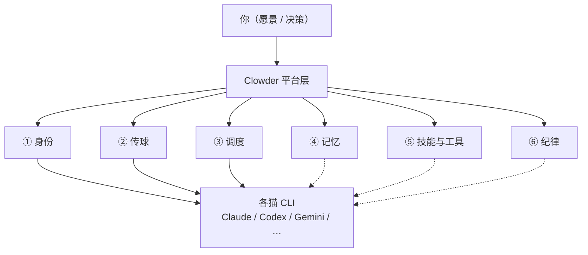

# Clowder 协作理解锚点

> **私人地图。** 聊天负责答疑，这里负责定锚。  
> **只收两样：** 能钉在脉络上的结论 · 当前卡点。  
> **不写：** 聊天原文、长教程、空壳章节。

### 怎么用

1. 先看 [总地图](#1-总地图)，点链路进脉络章  
2. 再看 [当前卡点](#2-当前卡点)——忘了聊到哪，看这里  
3. 深挖时进对应脉络章；主题多了会在章内再拆小节  

### 入库规矩

| 情况 | 动作 |
|------|------|
| 钉住一条新理解 / 纠正误解 | 写入对应脉络章（≤2 句）；需要时补小图 |
| 卡点变了 | 改写 §2（最多 3 条；懂了就删） |
| 冒出想挖的新题 | 只往 [待展开](#5-待展开) 加标题 |
| 以上都没有 | **本轮不改文件** |

### 三级结构（防糊墙）

```
总地图
  └─ 脉络章（固定 6 章，对应地图节点）
        └─ 主题小节（按需才建：钉过结论或点名要展开）
```

- 不预建空主题节  
- 某章主题超过 ~5 个 → 先加**章内小地图**，再列小节  

---

## 1. 总地图

一句话：Clowder 不替猫思考，只给它们当团队的办公室——谁是谁、球给谁、怎么排队、记什么、按什么规矩干。



**跳转（渲染器若不支持图内点击，用这行）：**  
[① 身份](#vein-identity) · [② 传球](#vein-pass) · [③ 调度](#vein-dispatch) · [④ 记忆](#vein-memory) · [⑤ 技能与工具](#vein-skills) · [⑥ 纪律](#vein-sop)

三层分工（背景，不单独成章）：

| 层 | 白话 | 干什么 |
|----|------|--------|
| 模型 | 脑子 | 推理、生成 |
| Agent CLI | 手脚 | 改文件、跑命令、用工具 |
| 平台（Clowder） | 办公室 | 身份、传话、排队、记忆、门禁 |

---

## 2. 当前卡点

| # | 卡在哪 | 为什么卡 | 下一问可以问 |
|---|--------|----------|--------------|
| 1 | 六条脉络都只钉了「一句话」 | 还没点名深挖任一条 | 选一条脉络展开（建议先 **传球**，最能体现多猫协作） |
| 2 | 主题小节尚未出现 | 按规矩：没钉结论就不预建空壳 | 深挖时自然长出第一节 |

（懂了就删行；整表最多 3 条。）

---

## 3. 脉络章

<a id="vein-identity"></a>

### ① 身份 — 每只猫是谁

**定锚：** 不是临时工具号，是长期队友——有名字、性格、角色；跨会话也还是「同一只猫」。

*（尚无主题小节）* · [回总地图](#1-总地图)

---

<a id="vein-pass"></a>

### ② 传球 — 谁该接着干

**定锚：** 球权 = 此刻该谁动手；`@猫` 是路由指令（叫醒谁），不只是聊天提醒。猫也可以把球传给另一只猫。

*（尚无主题小节）* · [回总地图](#1-总地图)

---

<a id="vein-dispatch"></a>

### ③ 调度 — 怎么叫醒、会不会撞车

**定锚：** 活进统一排队再叫猫；用户喊、外部消息、猫互传，插队规则不一样，避免乱撞或饿死某类任务。

*（尚无主题小节）* · [回总地图](#1-总地图)

---

<a id="vein-memory"></a>

### ④ 记忆 — 团队共用书架

**定锚：** 对话会丢、会话会断；证据 / 教训 / 决策进可检索的书架，需要时再查，而不是每次从头讲。

*（尚无主题小节）* · [回总地图](#1-总地图)

---

<a id="vein-skills"></a>

### ⑤ 技能与工具 — 说明书和工具箱

**定锚：** Skills = 按需加载的做事说明书；MCP = 共用工具接口，让不同猫都能回调平台能力。

*（尚无主题小节）* · [回总地图](#1-总地图)

---

<a id="vein-sop"></a>

### ⑥ 纪律 — 怎么一起把事做完

**定锚：** 固定台阶推进（设计确认 → 实现 → 自检 → 互审 → 合并 → 愿景守护）；尽量跨模型互审，少「自己夸自己」。

*（尚无主题小节）* · [回总地图](#1-总地图)

---

## 5. 待展开

只列标题，点名再挖。禁止在本节写正文。

- [ ] ② 传球：`@` 怎么路由、球权有哪些状态  
- [ ] ③ 调度：排队与「忙」时谁能插队  
- [ ] ① 身份：配置 / 会话绑定大概长什么样  
- [ ] ④ 记忆：证据怎么进、怎么搜  
- [ ] ⑤ Skills / MCP 一次调用链路  
- [ ] ⑥ SOP 五步和门禁谁卡谁  

---

## 修订记录

| 日期 | 改了什么 |
|------|----------|
| 2026-07-27 | 首版：总地图 + 六脉定锚 + 卡点 + 待展开；三级结构与入库规矩 |
