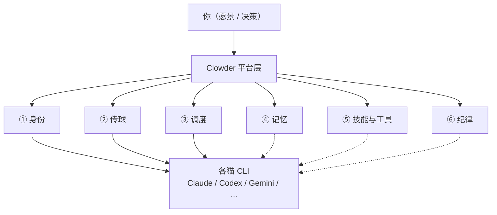
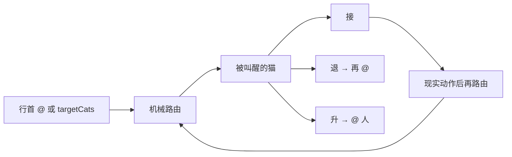
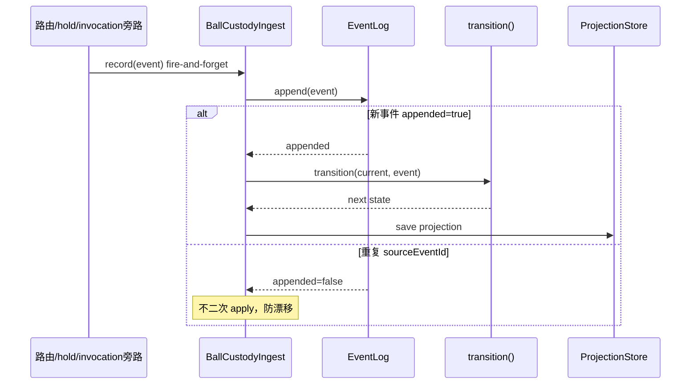
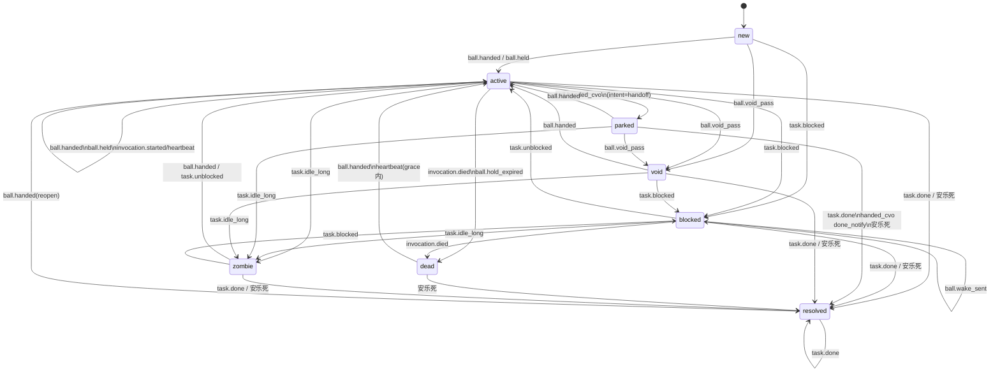

# Clowder 协作理解锚点

> **私人地图。** 聊天负责答疑，这里负责定锚。  
> **只收两样：** 能钉在脉络上的结论 · 当前卡点。  
> **不写：** 聊天原文、长教程、空壳章节。

### 怎么用

1. 先看 [总地图](#1-总地图)，点链路进脉络章  
2. 再看 [当前卡点](#2-当前卡点)——忘了聊到哪，看这里  
3. 深挖时进对应脉络章；主题多了会在章内再拆小节  

### 章节写法（推荐四层）

每个主题尽量按这个顺序——**人话抓住重点，再贴技术标签和类名**：

1. **概念**——机制是什么、解决什么问题（用项目词：球权、责任单元、行首 `@`…）  
2. **怎么维护 / 怎么运转**——在系统里靠什么更新、谁读谁写（仍用人话流程）  
3. **技术命名**——把上一步里的东西对上术语（账本 = append-only 事件日志；投影 = 由日志推导的当前快照…）  
4. **类 / 模块**——`packages/...` 里谁负责哪一段  

仍保留「问题引出」时可放在概念之前；防术语套术语：每一层里**先说完人话再括号标术语**。

脉络章开头：整章解什么问题 → 章级定锚 → 链到主题小节。

### 防「用新概念解释概念」

| 做法 | 例 |
|------|-----|
| ✅ | 「只追加的历史流水（**事件日志 EventLog**）→ 算出当前快照（**投影 Projection**）」 |
| ❌ | 「投影是事件溯源的物化读模型」 |

本图已出现的词优先复用。新术语首次出现必须带一句人话释义。

### 入库规矩

| 情况 | 动作 |
|------|------|
| 钉住一条新理解 / 纠正误解 | 写入对应主题：问题引出 + 定锚 + 必要技术段 |
| 卡点变了 | 改写 §2（最多 3 条；懂了就删） |
| 冒出想挖的新题 | 只往 [待展开](#4-待展开) 加标题 |
| 以上都没有 | **本轮不改文件** |

### 三级结构（防糊墙）

```
总地图
  └─ 脉络章（固定 6 章）
        └─ 主题小节（按需才建）
```

- 不预建空主题节  
- 某章主题超过 ~5 个 → 先加**章内小地图**，再列小节  

---

## 1. 总地图

**问题引出：** 多个强模型各自能干活，但跨会话身份、跨猫交接、排队、共享记忆、流程门禁并不自带——缺了平台层，人就会变成「人肉路由器」。

**定锚：** Clowder 是模型与 Agent CLI 之上的平台层，负责身份、A2A 球权路由、调度排队、记忆检索与 SOP 纪律；推理与工具执行仍由各猫 CLI 完成。



**跳转：**  
[① 身份](#vein-identity) · [② 传球](#vein-pass) · [③ 调度](#vein-dispatch) · [④ 记忆](#vein-memory) · [⑤ 技能与工具](#vein-skills) · [⑥ 纪律](#vein-sop)

三层分工：

| 层 | 负责 | 不负责 |
|----|------|--------|
| 模型 | 推理、生成 | 长期记忆、团队纪律 |
| Agent CLI | 工具、文件、命令 | 跨猫球权、互审编排 |
| 平台（Clowder） | 身份、A2A 路由、排队、记忆、SOP | 替模型推理 |

---

## 2. 当前卡点

| # | 卡在哪 | 为什么卡 | 下一问可以问 |
|---|--------|----------|--------------|
| 1 | ③ 调度：总体 + 出队 + 公平门已写 | busy gate 待展开 | 点名拆某一子题 |
| 2 | 其它五脉只有章级框 | 尚未深挖 | 身份 / 记忆 / Skills / SOP |

（懂了就删行；整表最多 3 条。）

---

## 3. 脉络章

<a id="vein-identity"></a>

### ① 身份 — 每只猫是谁

**问题引出：** 多 Agent 若每次都是匿名工具调用，就谈不上稳定角色、互审资格和跨 session 连续协作——先要回答「谁在说话、谁被叫到」。

**定锚：** 每只猫有稳定的 `catId` / roster 配置与会话绑定，跨 session 仍是同一身份，而不是一次性工具号。

*（尚无主题小节）* · [回总地图](#1-总地图)

---

<a id="vein-pass"></a>

### ② 传球 — A2A 球权与路由

**问题引出：** 多 Agent 同线程协作，必然涉及「下一条该谁处理」。若只靠人复制粘贴上下文，人或猫都会丢球。平台要在**不替模型猜意图**的前提下，把「叫醒谁 / 球在谁手里」变成可路由、可观测的动作——这就是 A2A（球权与路由）整章要解决的事。章内再拆：怎么从文本认出路由、没 `@` 怎么办、球丢了长啥样、短等待怎么持球。

**定锚：** 球权表示「此刻谁该对某个责任单元行动」；合法移交只有行首 `@` 文本路由或 MCP `targetCats`（及 multi_mention `targets`），接收方再决定接 / 退 / 升。

**章内跳转：** [传球大概](#pass-overview) · [@ 解析细则](#pass-mention-parse) · [回退梯](#pass-fallback) · [球权状态](#pass-dropped) · [hold_ball](#pass-hold) · [回总地图](#1-总地图)

<a id="pass-overview"></a>

#### 传球大概

**问题引出：** 有了「要传」的需求之后：消息怎么变成一次真实唤醒？平台若在路由层猜「用户本意」，既脆又和 LLM 能力重复。设计选择是——**代码只做机械叫醒；接 / 退 / 升留给被叫醒的猫**；并且「说了交给你」若没有系统动作，球权不能偷偷前进。

**定锚：** A2A 把「谁被叫醒」交给机械路由，把「接不接、退给谁、升给谁」交给被叫醒的猫；状态迁移须由现实动作产生，纯文字声明不算。



**技术密度**

| 出路 | 机制 | 代码锚 |
|------|------|--------|
| 文本路由 | 行首 `@handle` 解析成功 → 分发 | `a2a-mentions.ts` → `AgentRouter` / `route-serial` |
| 结构化路由 | MCP 发消息带 `targetCats`（或 `targets`） | `callback-tools` / `route-serial` |

流水线六层（`docs/architecture/at-mention-routing-system.md`）：

```
提及解析 → 目标解析(@→catId) → 无@则回退梯 → 分发调度
         → 上下文组装 → LLM 接/退/升
```

- 前 5 层：确定性代码；第 6 层：LLM 三选一  
- 「退」不是单独 API：再写行首 `@`，重新走提及解析  
- 真传球期望伴随 tool call / commit / review verdict 等；乒乓球与虚空传球针对声明与动作脱节  
- `hold_ball` 是有界持球例外，不是默认出口  
- 本层只决定**叫醒谁**；进队与 busy gate 属 [③ 调度](#vein-dispatch)

<a id="pass-mention-parse"></a>

#### @ 解析细则与交接上下文

**问题引出：** 文本里到处可能出现 `@`（邮箱、句中点名、代码块）。若全都当路由，会误叫醒；若没有任何结构化提示，被叫醒的猫也不知道「是点名交来的还是普通线程消息」。所以要两件事：**严格的可路由提及规则**，以及**调用侧注入交接字段**（不是在气泡里发明 XML tag）。

**定锚：** 文本路径只把「行首 `@` + mentionPatterns 命中」当成可路由提及；消息正文没有交接 XML tag，交接语义靠调用上下文字段注入 system prompt。

**实例：这句话到底在说什么**

「上下文字段」= 平台在**发起这次调用之前**填进 `InvocationContext` 的结构化字段（如 `directMessageFrom`），不是聊天气泡里的特殊标记。  
「注入 system prompt」= `SystemPromptBuilder` 把字段渲染成 prompt 文本，塞进本次 invoke 的系统侧提示，给**被叫醒的那只猫的 LLM**读。

分工：

| 步骤 | 谁做 | 要不要 LLM |
|------|------|------------|
| 解析行首 `@`、决定叫醒谁、写入 `directMessageFrom` 等 | 平台代码 | 否 |
| 渲染 D2/D4/D5 段进 system prompt | 平台代码 | 否 |
| 读到「Direct message from …；reply to …」后决定怎么回、是否再 `@` | 被叫醒的猫（LLM） | **是** |

例：缅因 `codex` 行首 `@opus` 把球传给布偶。串行路由里（`route-serial.ts`）会带上大致这样的上下文对象字段：

```ts
{
  catId: 'opus',                 // 被叫醒的是谁
  directMessageFrom: 'codex',    // A2A：前手是缅因（用户→猫时通常没有这个字段）
  mode: 'serial',
  chainIndex: 2,
  chainTotal: 2,
  a2aEnabled: true,
  // 可选：pingPongWarning / crossThreadReplyHint / teammates …
}
```

渲染进 prompt 后，布偶这次调用的系统侧会出现类似一行（测试断言同款）：

```text
Direct message from 缅因猫(codex) [model=…]; reply to 缅因猫(codex)
```

因此：交接的**路由与字段填充是系统内部**；交接的**语义理解与行为（回给谁、接/退/升）要靠 LLM 读这段 prompt**。没有字段时，猫仍能看见线程消息，但缺少机器保证的「这是点名交来的」提示。

**技术密度 — 解析**

文件：`packages/api/src/domains/cats/services/agents/routing/a2a-mentions.ts`

| 项 | 值 / 行为 |
|----|-----------|
| 单条目标上限 | `MAX_A2A_MENTION_TARGETS = 2` |
| 链深度（另一维度） | `getMaxA2ADepth()` → `MAX_A2A_DEPTH \|\| 15` |
| 行首规则 | F046：行首即路由，无需动作词；可带空白与 `>` / `-` / `1.` 前缀 |
| 句中 `@` | 不路由；影子检测（`InlineActionMention`）仅写侧反馈 |
| 匹配顺序 | `catRegistry.mentionPatterns`，**最长优先** |
| 边界 | `TOKEN_BOUNDARY_RE` / `HANDLE_CONTINUATION_RE` |
| 自提及 | 过滤；disabled → `routing_warnings` |
| 预处理（实现主路径） | 去掉围栏 `` ```...``` ``；可选行首空白修复 |

步骤：strip fence → 建 pattern 表 → 按行剥前缀 → 必须以 `@` 开头 → 最长匹配 + 边界 → 上限 2 停。

**技术密度 — 交接上下文**

叫醒仍靠行首 `@` 或 `targetCats`。被叫醒时 `SystemPromptBuilder` 注入：

| 字段 | Prompt 段 | 作用 |
|------|-----------|------|
| `directMessageFrom` | D2 | A2A 点名来源；优先回该猫 |
| 同族分身 | D3 | displayName 撞车时的分身提醒 |
| `crossThreadReplyHint` | D4 | `sourceThreadId` / `senderCatId` / 可选 `effectClass` |
| `pingPongWarning` | D5 | 同对连踢警告 |
| `teammates` / `mode` | D6/D7 | 队友与串行/并行 |

<a id="pass-fallback"></a>

#### 回退梯（本条无可路由 `@`）

**问题引出：** 人经常接话时不写 `@`（「看起来不错，合掉吧」）。若没有回退规则，要么静默没人醒，要么乱抓线程里最后发言的猫（系统 cross-post / 愿景守护也可能「最后发言」）。回退梯回答：**无显式路由时，按什么优先级仍能选出该叫醒谁**——且要符合「继续跟你刚才在跟的那只聊」。

**定锚：** 当本条消息没有可路由提及时，`AgentRouter` 按固定优先级选出目标猫；心智是延续最近的人↔猫对话，而不是「线程里谁最后发言」。

**技术密度**

文件：`AgentRouter.ts` → `peekTargets` / `findRecentUserMentionFallback`（F194）

1. **本条显式 mention**（含 `@all` / `@thread` 等）→ 直接用  
2. **`threadKind === 'concierge'`**：无本条 `@` 时固定 `preferredCats` 值班猫（不被历史 user mention 带走）  
3. **最近用户提及 fallback**  
   - 用户消息：`userId !== null && catId === null`  
   - 窗口：约 **5 条 user message** 或 **1 小时**  
   - 最近一条中的 routable mention → **单猫** deterministic fallback  
   - 不看猫消息  
4. **最后健康回复者**（`lastResponseHealthy !== false`）  
5. 偏好猫 / 任意健康参与者 / `getDefaultCatId()` 兜底  

**「最后发言的猫」和「最近一次对话的猫」可以不一致。**  
前者看线程时间线上谁最后开口（含猫↔猫 A2A、愿景守护 cross-post 等）；后者以**人的消息**为准（最近 user 消息里 `@` 过谁）。典型分叉：

| 时间线 | 线程最后发言 | 人最近在跟谁 | 你再不写 `@` 时优先叫醒谁 |
|--------|--------------|--------------|---------------------------|
| 你 `@布偶` → 布偶回 → 缅因因愿景守护/跨贴又发了一条 | 缅因 | 布偶（你上次 `@` 的） | **布偶**（用户提及 fallback 优先于最后回复者） |
| 布偶 `@缅因` review，缅因刚回完；你上一条 `@` 仍是布偶且在 1h/5 条窗内 | 缅因 | 仍可能是布偶（只看 user 消息里的 `@`） | **布偶**（窗内还能扫到那次 user `@`） |
| 窗内找不到带 `@` 的 user 消息 | （某只猫） | 含糊 | 才退到 **最后健康回复者** |

代码注释心智：`no @ = 继续刚才 @ 的猫里的一只`，**不是** `thread 里最近发言的猫`（F194；曾出现「明明 at 的是 47/55，却叫醒了 46」）。

**对偶缺口（已知张力）：** F194 把「用户提及」放在「最后回复者」之前，是为了挡住无关的最后发言（愿景守护 / cross-post）抢路由。但若链是：

`你 @Opus 写需求 → Opus @Codex 检视 → Codex 说没问题 → 你不写 @ 追问「废弃变量为啥没看出来」`

则窗内最近一次 **user `@` 仍是 Opus**，回退会优先叫醒 **Opus**，而不是刚做完检视的 **Codex**。  
人的心智更像 F078「接着跟刚聊完/刚干活的那只」；现行实现在「防抢路由」和「A2A 后追问审稿猫」之间偏了前者。  
（球权账本里球可能已在 Codex；**叫醒谁**仍走上述回退梯——两件事不要混。）

<a id="pass-dropped"></a>

#### 球权状态（掉球与保管链）

**问题引出：** 「谁该接着负责」若只等于「谁正在说话」，会漏掉 hold 等待、球晾在人手里、调用已死、嘴上说传了系统没动。需要独立于发言流的责任模型。

---

**① 概念**  
球权 = **谁该对某个责任单元行动**（线程 `ball:thread:{id}` 或任务 `ball:task:{id}`）。  
记录两件事：持球人 `holder`、形态 `BallState`（active / void / dead / …）。  
**不是**「谁正在发言」——可以持球不说话（hold），也可以说话但不持球（cross-post）。

**② 怎么维护**  
不靠改一张「当前持球人」表，而是：

1. 系统里发生真实动作（行首 `@` 投递、hold、invocation 死掉、task 阻塞…）  
2. 旁路记一条**只追加**的历史记录  
3. 用状态机规则，把「上一条快照 + 新记录」算成**新的当前快照**  
4. 值班简报等只读「当前快照」，不扫聊天记录猜  

快照坏了 → 把历史记录从头重放一遍即可恢复（rebuild）。

**③ 技术命名**

| 人话 | 术语 | 要点 |
|------|------|------|
| 历史流水、只增不改 | **事件日志**（EventLog，文档里也叫账本） | 真相源；`sourceEventId` 幂等 |
| 由流水算出的「现在谁负责、什么态」 | **投影**（Projection） | 可丢弃、可重建；不是第二套权威 |
| 快照 + 新事件 → 下一态 | **状态机** `transition()` | 纯函数，无 IO |
| 路由旁路写入 | **ingest** `record(event)` | fire-and-forget，失败不堵主流程 |

**④ 类 / 模块**（`packages/api/src/domains/ball-custody/`）

| 类 | 干什么 |
|----|--------|
| `ball-custody-events.ts` | 把动作包装成 `BallCustodyEvent` |
| `BallCustodyIngest` | 写入口：append 日志 → 新事件则更新投影 |
| `RedisBallCustodyEventLog` | 存事件日志（Redis LIST + seen SET） |
| `ball-custody-state-machine.ts` → `transition()` | 状态转移规则 |
| `BallCustodyProjector` | 读旧投影 → transition → 写 `holder`/`state`/… |
| `RedisBallCustodyProjectionStore` | 存投影快照 |
| `BallCustodyProbeScheduler` / `WakeSender` | blocked 探针与唤醒（副作用，不进 Projector） |

类型定义：`packages/shared/src/types/ball-custody.ts`。  
路由等（`route-serial`）只调 `ingest.record`，自己不改投影。

---

**维护时序（UML）**



**状态机（UML 状态图，主路径精简）**



**状态一览**

`BallState`：`new` → `active` | `blocked` | `parked` | `dead` | `void` | `zombie` | `resolved`

| 状态 | 含义 | 典型事件 |
|------|------|----------|
| active | 正常推进；hold 中常仍 active + `heldUntil` | `ball.handed`、`ball.held`、`invocation.*` |
| void | 声明传球但无系统动作 | `ball.void_pass` |
| dead | invocation 死或 hold 到期匹配 | `invocation.died`；`ball.hold_expired` |
| blocked | task 阻塞等探针 | `task.blocked`；`ball.wake_sent`（不改态） |
| parked | 球到 cvo/人晾着 | `ball.handed_cvo` + `intent=handoff` |
| zombie | 长期 idle | `task.idle_long` |
| resolved | 完成或安乐死 | `task.done`；`ball.frozen/degraded/abandoned` |

`handed_cvo` intent：`handoff→parked`，`done_notify→resolved`，`fyi` 不改态。  
`DEAD_BALL_ZOMBIE_GRACE_MS = 600_000`。

<a id="pass-hold"></a>

#### hold_ball

**问题引出：** 球仍属当前猫，但必须短等外部条件（CI 等）。不能空传给别人，也不能回合结束后永远没人再叫醒。

---

**① 概念**  
`cat_cafe_hold_ball` = **有界持球**：球还在你手里，但本轮先结束；平台在 `wakeAfterMs` 后**再叫醒你一次**（带 reason / nextStep 上下文）。  
默认出口仍是行首 `@` 传球；hold 是例外。

**② hold 期间系统处于什么状态？会不会调 CLI？**

分三条线看（不要混成「正在说话」）：

| 维度 | hold 等待中 | 到期唤醒时 |
|------|-------------|------------|
| **球权投影** | 通常仍 `active`；`holder` = 持球猫；`heldUntil` = 到期时间（`ball.held` 事件） | 唤醒任务触发；可能记 `ball.hold_expired`（与 `heldUntil` 匹配时 → 可转 `dead`，若随后再 invoke 可恢复） |
| **Invocation（本次调用）** | **已结束**——猫调完 hold_ball 工具后，当前回合/调用收尾，**等待期间没有 CLI 在跑** | **新建一次 Invocation** → 进队列 → **再起 CLI** |
| **调度器** | 注册一条 `hold-ball-*` 定时任务（`reminder` 模板），`fireAt = now + wakeAfterMs` | `reminder` 执行：往 thread 发唤醒消息 → `invokeTrigger.trigger(...)` |

所以：**hold 等待 = 球还在你名下 + 定时器挂着 + 当前 invocation 已停；不是「CLI 一直开着傻等」。**  
若 thread 正忙，唤醒可 `deferWhileThreadBusy` 顺延。用户新发消息可取消 pending hold（F167 Phase J）。

**③ 技术命名**

- 持球登记：`POST /api/callbacks/hold-ball`（`callback-hold-ball-routes.ts`）  
- 定时唤醒：`reminder` 模板 + `TaskRunnerV2.registerDynamic`  
- 球权旁路：`buildHeldEvent` → `BallCustodyIngest.record`  
- MCP 入口：`handleHoldBall` → `callback-tools.ts`

**④ 类 / 路由**

| 组件 | 作用 |
|------|------|
| `handleHoldBall` / `callback-hold-ball-routes.ts` | 校验、登记定时任务、记 `ball.held`、线程可见消息 |
| `reminderTemplate`（`scheduler/templates/reminder.ts`） | 到点发消息 + `invokeTrigger.trigger` 再叫醒猫 |
| `BallCustodyIngest` + `buildHeldEvent` | 投影里写 holder / heldUntil |
| `hold-ball-cancel.ts` | 用户消息时取消 pending hold |

约束：`wakeAfterMs` 5s–1h；约 1h 内同 `(thread,cat)` 最多 3 次 hold；单槽（新 hold 顶掉旧 wake）。

---

#### 基础概念：thread 与 invocation

**问题引出：** 消息挂在哪、一次「叫醒猫干活」怎么记账，需要两个不同粒度的容器。

**① 概念**

| | **Thread（线程）** | **Invocation（调用）** |
|--|-------------------|------------------------|
| 人话 | 一条**对话线** / 房间：消息按时间堆在这里 | **一次**「叫醒某猫处理某事」的执行周期 |
| 生命周期 | 长；可跨很多轮人机/猫猫对话 | 短；`queued → running → succeeded/failed` |
| 典型内容 | 消息列表、参与者、路由偏好、球权 `ball:thread:{id}` | 这次叫醒谁（`targetCats`）、关联哪条用户消息、状态与 token 用量 |

**② 怎么维护**  
- Thread：`ThreadStore` 管元数据与参与者；`MessageStore` 存消息。  
- Invocation：`InvocationRecordStore` 管单次调用状态机（ADR-008）；一次用户消息或定时唤醒可创建一条 record，再驱动 CLI。

**③ 技术命名**  
`ThreadId` / `InvocationRecord` / `InvocationStatus`（`queued` | `running` | `succeeded` | `failed` | `canceled`）

**④ 类**  
`ThreadStore.ts` · `InvocationRecordStore.ts` · 路由侧 `InvocationQueue` / `route-serial` 创建并消费 invocation。

**和 hold 的关系：** hold 挂在某个 **thread** 上；等待期没有活跃 **invocation**；到期在**同一条 thread** 里触发**新的 invocation** 再起 CLI。

---

<a id="vein-dispatch"></a>

### ③ 调度 — 怎么叫醒、会不会撞车

**问题引出：** 路由已经决定「该叫醒谁」，但同一只猫可能正忙、多来源（用户、A2A、连接器、定时）会抢同一执行槽。若没有统一排队与分层 busy gate，就会插队、饿死或重复 invoke——调度回答「叫醒如何落地为有序执行」。

**定锚：** 路由定「叫醒谁」；调度定「现在能不能跑、忙则排队、按什么顺序出队」——统一走 `InvocationQueue` + `InvocationTracker`，busy gate 按来源分层（F175 / F185）。

**章内跳转：** [调度总体](#dispatch-overview) · [核心概念](#dispatch-core-concepts) · [并行粒度](#dispatch-parallel-granularity) · [出队排序](#dispatch-dequeue-ordering) · [公平门](#dispatch-fair-gate) · [回总地图](#1-总地图)

<a id="dispatch-overview"></a>

#### 调度总体

**问题引出：** 同一条 thread 里，用户消息、A2A 续传、GitHub CI 通知、hold 定时唤醒可能同时到达；若「谁在跑」和「谁在等」各搞一套，会出现抢占 CLI、消息静默丢弃、或 connector 被猫链饿死。调度要在**不替代路由**的前提下，把「一次 invocation 如何落地执行」管起来。

---

**① 概念**  
调度 = **执行平面**：路由已经给出 `targetCats` 之后，决定这次是**立刻起 CLI**，还是**先入队**，以及**按什么顺序出队**。  
两个互补部件（代码注释原话）：

| 部件 | 人话 | 术语 |
|------|------|------|
| `InvocationTracker` | **谁在跑**（占用执行槽 / 可 abort） | 互斥 / busy |
| `InvocationQueue` | **谁在等**（排队条目） | QueueEntry |

一条典型路径：

```
消息/唤醒到达（用户 / connector / A2A / hold 到期…）
  → 路由：targetCats 已定
  → 调度：thread/槽 是否 busy？
       ├─ 空闲 → 直接 routeExecution → invocation running → CLI
       └─ 忙   → InvocationQueue.enqueue → 等当前 invocation 完成
                 → QueueProcessor.onInvocationComplete / tryAutoExecute
                 → 按优先级出队 → 再起 CLI
```

和传球的关系：**② 传球**只决定进队前的目标猫；**③ 调度**决定何时、以何优先级真正执行。hold 到期唤醒也走 `invokeTrigger` → 同样进这套平面。

**② 怎么维护（总体行为）**

1. **入队**：来源标 `source`（`user` | `connector` | `agent`）+ 可选 `sourceCategory`（`ci` / `review` / `a2a` / `continuation`…）+ `priority`（`urgent` | `normal`）。  
2. **判忙（分层，F185）**：用户主动发消息、外部 connector 事件、A2A 猫链**不能共用同一套「忙了就丢」规则**——例如 connector 在 thread 忙时应**排队**，而不是和猫抢槽乱并发。  
3. **出队（F175）**：统一队列内排序，大致 `手动 position` → `priority` → `createdAt`；**取消**早年「urgent 直接抢占正在跑的 invocation」的 bypass。  
4. **公平（F185）**：若队列里已有 **non-agent**（用户 / connector）在等，**暂缓**再启动新的 agent 链，避免 CI/外部消息被 A2A 饿死。  
5. **完成回调**：一次 invocation 结束 → `onInvocationComplete` → `tryAutoExecute` 尝试拉下一条。

**③ 技术命名**

| 人话 | 术语 |
|------|------|
| 排队条目 | `QueueEntry`（`InvocationQueue`） |
| 自动拉下一单 | `tryAutoExecute` / `onInvocationComplete`（`QueueProcessor`） |
| 占槽 / 释放槽 | `InvocationTracker.start` / `startAll` / `complete` |
| 外部自动化唤醒入口 | `ConnectorInvokeTrigger.trigger()` |
| 用户发消息入口 | `messages.ts` → 路由 + 入队 |
| hold 定时唤醒 | `reminder` → `invokeTrigger.trigger` → 同上 |

**④ 类 / 模块**（`packages/api/src/domains/cats/services/agents/invocation/`）

| 类 | 作用 |
|----|------|
| `InvocationQueue` | per-thread 排队、优先级、去重、公平查询 |
| `QueueProcessor` | 出队、合并连续用户消息、驱动 `routeExecution` |
| `InvocationTracker` | 运行中槽位、thread/cat 级 busy |
| `InvocationRecordStore` | 单次 invocation 生命周期记账（与队列互补） |
| `ConnectorInvokeTrigger` | connector/外部事件 → 判忙 → 执行或入队 |

文档：`F175`（统一队列与优先级）· `F185` / ADR-034（busy gate 分层与公平）· cell `dispatch`。

---

<a id="dispatch-core-concepts"></a>

#### 核心概念：ideate / execute / entry / invocation / 槽

**问题引出：** 聊调度时容易把「排队票」「一趟执行」「并行 brainstorm」「占槽」混成一团。先把五个词钉死，后面 busy gate、出队细则才说得清。

---

**① 概念**

| 词 | 人话 | 管哪一层 |
|----|------|----------|
| **ideate** | 多猫**各自独立思考**（头脑风暴） | 一次 invocation **内部**怎么协作 |
| **execute** | 多猫**按任务链接力**（流水线 / A2A 链） | 同上 |
| **entry** | 排队里的**一张工单**（thread 忙时先等着） | **调度 / 队列**层 |
| **invocation** | **一趟真正跑起来**的执行周期（有 `invocationId`、状态机） | **执行记账**层 |
| **槽（slot）** | 某 thread 里某只猫**此刻有没有占着 CLI 在跑** | **互斥 / 占槽**层 |

**关系（自上而下）：**

```
用户消息 / connector / A2A / hold 唤醒
        │
        ▼
   路由：targetCats + intent（ideate / execute）
        │
        ├─ thread 忙？ ──是──► InvocationQueue.enqueue → entry（排队）
        │                              │
        └─ 空闲 ───────────────────────┤
                                       ▼
                          出队 / 直接执行 → 创建 InvocationRecord（一次 invocation）
                                       │
                          start / startAll 占住各猫的槽（slot）
                                       │
                    ┌──────────────────┴──────────────────┐
                    ▼                                      ▼
            intent=ideate 且多猫                    intent=execute 或单猫
            routeParallel                           routeSerial
            多猫同时跑（多槽并行）                   多猫一只接一只（单槽轮流）
```

**层级对照：**

| 层级 | 概念 | 数量关系 |
|------|------|----------|
| thread | 对话线 | 1 条 thread 里可有多条 entry 排队 |
| entry | 排队票 | 多条 entry → 通常**依次**变成多次 invocation |
| invocation | 一趟执行 | 1 次 invocation 可带**多只** `targetCats` |
| slot | 猫占用的跑位 | 1 次 invocation 可占**多个** slot（并行时） |
| intent | 协作模式 | 钉在 entry / invocation 上，决定 parallel 还是 serial |

**② 怎么维护**

- **ideate / execute 从哪来**：`IntentParser.parseIntent(message, targetCatCount)`——显式 `#ideate` / `#execute` 优先；否则 ≥2 猫 → `ideate`，1 猫 → `execute`。`#critique` 等是 **prompt tag**，只改思维方式，**不改**路由意图。  
- **entry 何时产生**：`messages.ts` / `ConnectorInvokeTrigger` 等入口发现 thread 忙（`InvocationTracker.has(threadId)`）→ `InvocationQueue.enqueue`。  
- **invocation 何时产生**：`QueueProcessor.executeEntry` 出队时 `invocationRecordStore.create(...)`；或直接执行路径在占槽后创建。  
- **槽何时占/放**：执行前 `start`（单猫）或 `startAll`（多猫并行批次）；结束 `complete` / `completeAll`；同猫同 thread 新 invocation 可 **抢占（abort）** 旧槽。

**③ 技术命名**

| 人话 | 术语 |
|------|------|
| 路由意图 | `Intent` = `'ideate' \| 'execute'`（`IntentParser`） |
| 路由策略 | `strategy` = `'parallel' \| 'serial'`（`AgentRouter`：`ideate && 多猫` → parallel） |
| 排队条目 | `QueueEntry`（含 `intent`、`targetCats`、`source`、`priority`…） |
| 执行记账 | `InvocationRecord`（`InvocationRecordStore`） |
| 执行槽 | `ExecutionSlot(threadId, catId)`（F108，`InvocationTracker`） |

**④ 类**

`IntentParser.ts` · `AgentRouter.ts`（`routeParallel` / `routeSerial`）· `InvocationQueue.ts` · `QueueProcessor.ts` · `InvocationTracker.ts` · `InvocationRecordStore.ts`

**易混点**

- **entry ≠ invocation**：多条连续 user entry 可能被 batch **合并成一次** invocation；一次 invocation 结束后再拉**下一条** entry。  
- **intent 钉在 entry/invocation 上**，不钉在 slot 上——槽只回答「这只猫此刻占不占 runner」。

---

<a id="dispatch-parallel-granularity"></a>

#### 并行粒度：不是全局顺序独占

**问题引出：** 「调度是不是一只猫跑完另一只才能跑？」——不是。猫咖是 **单猫独占槽 + 多猫可并行 + thread 级入队互斥** 三层叠在一起。

---

**① 概念**

| 粒度 | 规则 | 人话 |
|------|------|------|
| **单猫 × 单 thread** | 独占 | 同一只猫在同 thread 同时只能跑一个 invocation；新来的可抢占旧的 |
| **多猫 × 单 thread** | 可并行 | 不同猫占不同槽 `(threadId, catId)`，**可以同时跑**（F108） |
| **单 thread 入队** | 大体顺序 | thread 里若已有猫在跑，新叫醒请求**先入队**；当前这波结束再出队 |

**同 thread + 同 invocation 内能否多猫并行？**

| 条件 | 结果 |
|------|------|
| `intent = ideate` 且 `targetCats.length > 1` | **能** — `startAll` 占多槽，`routeParallel` 同时起多个 CLI |
| `intent = execute`，或只有 1 只猫 | **不能** — `routeSerial`，worklist 一只接一只 |
| 用户写 `#execute @A @B` | 即使两只猫也**强制串行** |

分叉（`AgentRouter`）：`strategy = ideate && 多猫 ? 'parallel' : 'serial'`。

**② 怎么维护**

- 并行批次：`QueueProcessor` → `invocationTracker.startAll(threadId, targetCats)` → `routeParallel`；各猫独立 `AbortController`，取消一只不误伤同批其它猫（F-parallel-cancel）。  
- 串行链：`routeSerial` + worklist；A2A 目标通过 `trackExternalSlot` 保持 thread 级 busy，避免球还没传完就误拉下一单。  
- thread 级门：非 force 路径 `tryStartThreadAll` — 若 `has(threadId)` 为真则降级入队，不硬插。  
- 不同 **thread** 互不影响，可各自并行。

**③ 技术命名**

| 人话 | 术语 |
|------|------|
| 多槽并发能力 | F108 `ExecutionSlot(threadId, catId)` |
| 并行路由 | `routeParallel` + `startAll` |
| 串行路由 | `routeSerial` + worklist |
| 非抢占占槽 | `tryStartThread` / `tryStartThreadAll` |
| 抢占占槽 | `start` / `startAll`（同槽 abort 旧 invocation） |

**④ 类**

`InvocationTracker.ts`（文件头注释即 F108 语义）· `route-parallel.ts` · `route-serial.ts` · `AgentRouter.ts`

**一句话：** entry 之间顺序；**同一次 ideate invocation 之内**可以多猫并行；execute / A2A 链则一只接一只。

---

<a id="dispatch-dequeue-ordering"></a>

#### 出队排序与 QueueEntry

**问题引出：** 队列不是纯 FIFO——F175 之后 urgent 不再抢占正在跑的 invocation，而是靠**队内排序**决定谁先出队；用户还能拖动改顺序。若不钉清比较器规则，会误以为「先 enqueue 的一定先跑」或「CI urgent 会踢掉正在跑的猫」。

---

**① 概念**

出队 = 从所有 `status === 'queued'` 的 entry 里，用 **`compareEntries` 多维比较器** 选出「当前该跑的那张票」，再 `markProcessing` 标成 `processing`。

**排序优先级（高 → 低）：**

| 顺位 | 条件 | 人话 |
|------|------|------|
| 0 | **系统钉死** | `source=agent` 且 `sourceCategory=continuation` 的续传 entry **永远最前**（`isSystemPinnedQueueEntry`） |
| 1 | **手动 position** | 仅**同一 userId** 内比较：有 `position` 的排在没 position 前面；都有则 `position` 数值小的在前（拖动排序） |
| 2 | **priority** | `urgent`（0）> `normal`（1） |
| 3 | **createdAt** | 越早创建越先出（FIFO 兜底） |

**不参与排序的字段：** `sourceCategory`（`ci` / `review` / `a2a`…）只用于 UI 分组与诊断，**不改变**出队顺序。

**存储 vs 排序：** entry 按 `threadId:userId` 存在内存数组里（enqueue 时 `push`），但出队前会 **`sort(compareEntries)`**，所以物理插入顺序≠出队顺序。

**② 怎么维护（出队路径）**

1. **系统级拉下一单**（invocation 成功后）：`onInvocationComplete` → `tryExecuteNextAcrossUsers` → `markProcessingAcrossUsers(threadId, skipCatIds)`——**跨所有 user** 扫一遍，按比较器取最优；若目标猫槽仍忙则 `rollbackProcessing` 并跳过该猫继续扫。  
2. **用户手动拉下一单**：`processNext` → `peekNextQueued`（同 user 内排序预览）→ 槽空闲 → `markProcessing`。  
3. **A2A 自动拉**（`autoExecute` entry）：`tryAutoExecute` 单独扫 agent 条目，按 `createdAt`（**不走**完整比较器）；且若队列里有 **non-agent**（user/connector）在等，默认**暂缓** agent 链（公平门，F185）。  
4. **用户消息 batch**：出队后若 `source === 'user'`，`collectUserBatch` 在**已排序**的 queued 列表里，收集紧随其后的连续 user entry（同 `intent`、同 `targetCats` 集合）→ **合并成一次 invocation 的 content**；connector/agent **始终单条**处理。拖动改 `position` 可打断 batch 边界。  
5. **入队时 priority 归一**：普通 `agent` entry（非 continuation）**强制** `normal`，防止 A2A 链靠 urgent 插队；continuation 可被系统钉死到最前。  
6. **容量**：仅 **user** 来源限深 `MAX_QUEUE_DEPTH = 5`；connector/agent 无硬上限（靠其它 guard）。

**③ 技术命名**

| 人话 | 术语 / API |
|------|------------|
| 比较器 | `InvocationQueue.compareEntries` |
| 跨用户取最优 | `peekOldestAcrossUsers` / `markProcessingAcrossUsers` |
| 单用户取最优 | `peekNextQueued` / `markProcessing` |
| 用户拖动 | `setPosition` / `move` / `promote` |
| 合并连续用户消息 | `collectUserBatch` |
| 公平门 | `hasQueuedNonAgentForThread` + `tryAutoExecute` 入口检查 |
| 系统钉死续传 | `isSystemPinnedQueueEntry` |

**QueueEntry 与排序相关字段：**

| 字段 | 作用 |
|------|------|
| `priority` | `urgent` \| `normal` |
| `position` | 用户手动排序（可选；同 user 内优先于 priority） |
| `source` | `user` \| `connector` \| `agent`（影响 batch、容量、公平门） |
| `sourceCategory` | 分组标签，**不参与**比较器 |
| `continuationKey` | agent 续传去重 |
| `createdAt` | 最终 FIFO  tiebreaker |
| `status` | `queued` → `processing`（出队时改） |

**④ 类**

`InvocationQueue.ts`（`compareEntries`、出队 API）· `QueueProcessor.ts`（`tryExecuteNextAcrossUsers`、`collectUserBatch` 消费侧）· `docs/features/F175-unified-message-queue.md`

**和 F175 的关系：** 早年 urgent connector 走 bypass **抢占**正在跑的 invocation；F175 删掉 bypass，urgent 语义变为「**优先出队**」，不再 abort 活跃 CLI。

**常见澄清（研讨中问过）**

| 疑问 | 人话答案 |
|------|----------|
| **多 User 是什么？日常不是只有一个 co-creator 吗？** | 对，**典型单机部署只有一个真人**（co-creator，`userId` 固定）。队列在存储上仍按 `threadId:userId` 分桶，是为了**隔离权限与未来多用户**（F077 共享协作、F134 飞书群等多真人场景）。`AcrossUsers` API = 系统从**同一条 thread 的所有 user 桶**里挑下一张票；你现在只有一桶时，行为等价于「只扫你自己」。`position` 只在**同一 userId** 内比较，是为防共享 thread 里 A 用户拖动影响 B。 |
| **continuation 是什么？** | **会话续传工单**：某猫一轮 invocation 因上下文封印（session seal / compact 边界等）需要**新开一轮**继续干时，平台自动 `enqueue` 一条 `source=agent` + `sourceCategory=continuation` 的 entry，带上 `CollaborationContinuityCapsule`（上一轮交接胶囊）。`autoExecute=true`，且被**系统钉死**在队首（`isSystemPinnedQueueEntry`），优先于普通 urgent。人话：**同一只猫的工作没做完，系统帮它排一张「续干」的票**。 |
| **手动拖动在哪？是 status bar 吗？** | **不是** `ThreadExecutionBar`（输入框上方那条）——那条只显示**正在跑哪只猫**、停止/强重置。**排队拖动**在紧挨其下的 **`QueuePanel`（「排队中」面板）**：thread 忙时你的消息会进队，列表支持 **drag & drop** 改顺序 → `PATCH /api/threads/:threadId/queue/reorder` 写 `position`。也可删单条、撤回编辑、steer 提前。只有 `status=queued` 的可见 entry 能拖；`continuation` 系统钉死项不能拖。 |

前台布局（`ChatContainer`）：`ThreadExecutionBar`（谁在跑）→ `QueuePanel`（谁在等、可拖动）→ 输入框。

---

<a id="dispatch-fair-gate"></a>

#### 公平门（non-agent 防饿死）

**问题引出：** 猫链（A2A）可以一轮接一轮自动扩展 worklist；若队列里已经排着**你的消息**或 **CI/review 等 connector 通知**，猫链仍继续 `@下一只猫`，外部消息会**永远排不上**——F185 现场案例：opus 在 A2A round 2，CI failure 已入队，猫链仍扩展 → connector 饿死。

**定锚：** **公平门 = 队列里只要有「真人/外部」在等（non-agent），就暂缓继续扩猫链或自动拉新的 agent entry**；non-agent 先出队跑完，再 `tryAutoExecute` 拉起 deferred A2A。

---

**① 概念**

| 词 | 包含 | 不算 |
|----|------|------|
| **non-agent** | `source=user`（你发的）· `source=connector`（CI/review/定时等） | — |
| **agent** | `source=agent`（A2A 传球、deferred handoff 等） | `sourceCategory=continuation` 是**续传**，走系统钉死队首，不走公平门挡别人 |

人话：**你或外部系统的事，优先于猫自动接力扩链。**

**两条 enforcement 路径（F185 Phase A + B）：**

```
路径 1 — tryAutoExecute 入口（Phase A）
  队列有 non-agent 在等？
    → hasDispatchableNonAgentQueued(threadId) === true
    → tryAutoExecute 直接 return，不启动新的 autoExecute agent entry

路径 2 — routeSerial text-scan（Phase B）
  猫输出里扫到 @下一只猫，本来要立刻扩 worklist
    → hasQueuedNonAgentForThread(threadId) === true
    → 不 inline 扩展；改为 defer_queue：把 A2A 目标入队排在 non-agent 后面
    → non-agent 跑完后 onInvocationComplete → tryAutoExecute 再拉起 deferred A2A
```

**和出队排序的关系：** 公平门管的是「**能不能继续产/拉 agent 活**」；`compareEntries` 管的是「多张票里谁先出」。两者叠加：non-agent 通常已按 urgent/createdAt 排在前面，公平门再保证猫链不会在它们前面偷偷开新坑。

**② 怎么维护**

1. **检测 API**：`InvocationQueue.hasQueuedNonAgentForThread(threadId)` — 该 thread 任意 user 桶里是否存在 `status=queued` 且 `source !== 'agent'` 的 entry。  
2. **tryAutoExecute 门**：`QueueProcessor.hasDispatchableNonAgentQueued` — 在 (1) 基础上再排除「目标猫槽处于 paused」的 non-agent（暂停槽上的排队不算可调度阻塞）。  
3. **A2A text-scan 门**：`route-serial` 里 `queueHasQueuedMessages` 回调实际接 `hasQueuedNonAgentForThread`（**含 connector**，不再只看 user）。  
4. **defer 而非丢弃**：gate 命中时 `resolveRoutingDecisions` → `defer_queue` → 入队 `source=agent, sourceCategory=a2a, autoExecute=true`，携带 `callerCatId` + 完整 `content`（猫 A 输出）供猫 B 续干。  
5. **例外 / 绕过**：`tryAutoExecute(..., { bypassNonAgentGate: true })` 仅用于 continuation 恢复等窄场景；`continuation` 系统钉死项不受 AC-8「agent 禁 urgent」约束；`relay_malformed` 恢复路径不走 fairness 链。

**③ 技术命名**

| 人话 | 术语 |
|------|------|
| 公平不变式 | F185 AC-6/7 · ADR-034 OQ-3 fairness invariant |
| 有外部在等？ | `hasQueuedNonAgentForThread` |
| 可调度地挡 agent？ | `hasDispatchableNonAgentQueued` |
| A2A 延后入队 | `defer_queue` / deferred enqueue（F185 Phase B） |
| agent 不能 urgent 插队 | enqueue 校验：agent 且非 continuation → 强制 `normal` |

**④ 类**

`InvocationQueue.ts` · `QueueProcessor.ts`（`tryAutoExecute` 早退）· `route-serial.ts`（text-scan gate）· `routing-decision.ts`（`defer_queue` 决策）· `docs/features/F185-dispatch-busy-gate-unification.md`

**场景对照**

| 场景 | 无公平门 | 有公平门 |
|------|----------|----------|
| 猫 A 跑着，CI 通知入队，猫 A 输出 `@猫B` | worklist 立刻扩到猫 B，CI 继续等 | A2A **入队延后**，CI **先出队** |
| 队列只有 agent 互 @ | 正常扩链 / autoExecute | **不挡**（agent 不挡 agent） |
| 猫 session 需 continuation 续传 | — | **钉死队首**，不受公平门压制 |

**待展开（点名再挖）**  
- busy gate：thread 级 vs cat 级 vs 来源分层  
- 公平门（non-agent 防饿死）细则  
- hold 唤醒在 busy 时的 `deferWhileThreadBusy`

---

<a id="vein-memory"></a>

### ④ 记忆 — 证据与检索

**问题引出：** 每次 invoke 上下文有限且会压缩；团队决策与教训若只活在对话里，换 session 就丢。记忆回答：如何把可追溯材料变成可检索证据，供猫按需取用。

**定锚：** 可检索的证据库（evidence）承载跨会话知识；猫按需经检索接口取用，而不是每次靠全文重讲。

*（尚无主题小节）* · [回总地图](#1-总地图)

---

<a id="vein-skills"></a>

### ⑤ 技能与工具 — Skills 与 MCP

**问题引出：** 平台能力与做事流程若全塞进常驻 prompt，会又胖又难演进；若各猫各接一套工具，协作面分裂。Skills / MCP 回答：流程说明书如何按需加载、工具如何经统一回调面共享。

**定锚：** Skills 是按需加载的流程说明书（manifest）；MCP 是跨猫共用的工具回调面。

*（尚无主题小节）* · [回总地图](#1-总地图)

---

<a id="vein-sop"></a>

### ⑥ 纪律 — SOP 与门禁

**问题引出：** 多猫能传能写，仍可能跳过设计确认、自我放行合并、或做完却偏离愿景。SOP / 门禁回答：协作如何按台阶推进并强制跨模型互审与愿景核对。

**定锚：** 开发按 SOP 台阶推进（Design Gate → impl → quality-gate → review → merge-gate → 愿景守护）；跨模型互审降低自我放行。

*（尚无主题小节）* · [回总地图](#1-总地图)

---

## 4. 待展开

只列标题，点名再挖。禁止在本节写正文。

- [x] ② 传球：大概 → [传球大概](#pass-overview)
- [x] ② 传球：`@` 解析 + 交接上下文 → [@ 解析细则](#pass-mention-parse)
- [x] ② 传球：回退梯 → [回退梯](#pass-fallback)
- [x] ② 传球：球权状态 → [球权状态](#pass-dropped)
- [x] ② 传球：`hold_ball` → [hold_ball](#pass-hold)
- [x] ③ 调度：总体 → [调度总体](#dispatch-overview)
- [x] ③ 调度：核心概念 → [核心概念](#dispatch-core-concepts)
- [x] ③ 调度：并行粒度 → [并行粒度](#dispatch-parallel-granularity)
- [x] ③ 调度：出队排序与 QueueEntry → [出队排序](#dispatch-dequeue-ordering)
- [x] ③ 调度：公平门 → [公平门](#dispatch-fair-gate)
- [ ] ③ 调度：busy gate 分层（thread / cat / 来源）
- [ ] ③ 调度：hold 唤醒与 `deferWhileThreadBusy`
- [ ] ① 身份：roster / 会话绑定
- [ ] ④ 记忆：索引与检索路径
- [ ] ⑤ Skills / MCP 一次调用链路
- [ ] ⑥ SOP 五步与门禁

---

## 修订记录

| 日期 | 改了什么 |
|------|----------|
| 2026-07-27 | 首版：总地图 + 六脉定锚 + 卡点 + 待展开 |
| 2026-07-27 | ② 传球：大概 / @解析 / 回退梯 / 掉球 / hold_ball |
| 2026-07-28 | 「一句定锚 + 技术密度」；去掉外部比喻 |
| 2026-07-28 | 升级为三段式：问题引出 → 定锚 → 技术密度 |
| 2026-07-28 | @解析节补「上下文字段注入」实例 |
| 2026-07-28 | 回退梯补：最后发言 vs 最近对话可分叉 |
| 2026-07-28 | 回退梯补对偶缺口：A2A 后无@追问可能仍打到旧 user @ |
| 2026-07-28 | 球权节：定义≠发言；事件溯源；状态机+序列 UML |
| 2026-07-28 | 球权节：账本=EventLog；类职责表 |
| 2026-07-29 | 投影=当前快照；防新概念套概念 |
| 2026-07-29 | 写法升级为四层；球权节按四层重写 |
| 2026-07-29 | hold_ball：等待期状态表 + 是否调 CLI；补 thread vs invocation |
| 2026-07-31 | ③ 调度：总体 + 核心概念（ideate/entry/execute/槽）+ 并行粒度 |
| 2026-07-31 | ③ 调度：出队排序（compareEntries 四维 + batch + F175） |
| 2026-07-31 | ③ 调度：澄清 multi-user / continuation / QueuePanel 拖动 |
| 2026-07-31 | ③ 调度：公平门（tryAutoExecute + text-scan defer_queue） |
