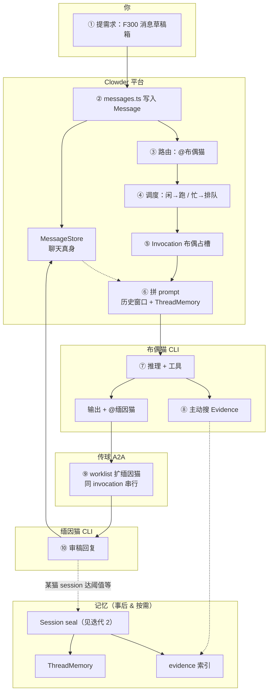
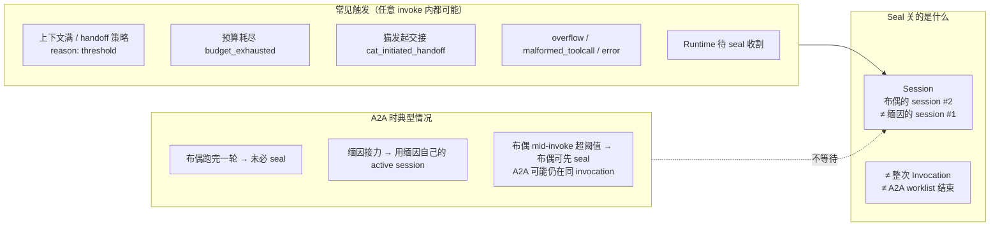

# 消息流转图（渐进迭代）

> **私人学习用。** 每次讨论只 **追加** 新版 mermaid，**不修改** 旧版图（除非你明确要求改旧图）。
> 主地图仍见 [`clowder-collab-map.md`](./clowder-collab-map.md)。

## 使用规矩

| 规矩 | 说明 |
|------|------|
| **只追加** | 新一节 = 新日期 + 新图 + 简短说明 |
| **不改旧图** | 保留每次迭代的痕迹；纠错用「勘误」小节文字说明，不重绘旧节 |
| **粒度** | 第一版求串概念；细节以后另开迭代 |

---

## 迭代 1 — 2026-08-11 · F300 全景（第一版）

**场景：** 你提需求「做 F300 消息草稿箱」，@布偶猫设计，布偶 @缅因猫审稿。  
**目的：** 串 Thread / Message / 路由 / 调度 / Invocation / A2A / 记忆注入 vs 检索。  
**刻意省略：** 公平门、KV 便签、Event Memory、七工具全集。

**两条记忆线：**

- **实线左支：** Message → MessageStore → invoke **直接读历史**（聊天记录传输）
- **虚线右支：** seal 后 → ThreadMemory + evidence（**编译型记忆**，以后可搜 / bootstrap 注入）

**10 个主干词：** Thread · Message · 路由 · 调度 · Invocation · A2A · 上下文注入 · Evidence · 主动检索 · Seal/摘要

---

## 迭代 2 — 2026-08-11 · Session seal 何时发生（答疑图）

**问题：** Session seal 是不是只有 A2A 结束后才做？  
**结论：** **不是。** seal 关的是 **某一只猫的一条 Session**（per-cat × per-thread 的 CLI 会话链），与「整次 invocation 结束」或「A2A 链跑完」**无固定绑定**。

**Seal 之后做什么（finalize）：** transcript 落盘 → handoff digest → **`buildThreadMemory`**（thread 摘要）→ 索引进 evidence。  
**代码锚点：** `SessionSealer.requestSeal` / `finalize` · `session-strategy.shouldTakeAction` · `invoke-single-cat`（mid-stream defer seal 在 `done` 边界执行）

---

## 修订记录

| 日期 | 迭代 | 说明 |
|------|------|------|
| 2026-08-11 | 1 | F300 全景第一版 |
| 2026-08-11 | 2 | Session seal 与 A2A 关系答疑 |
