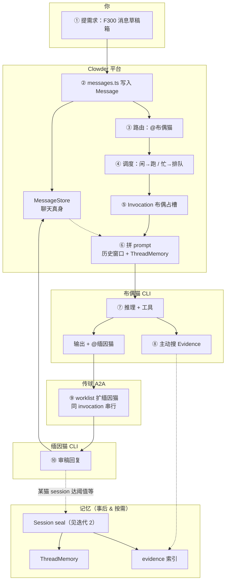
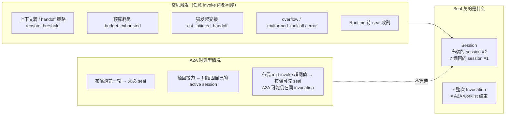
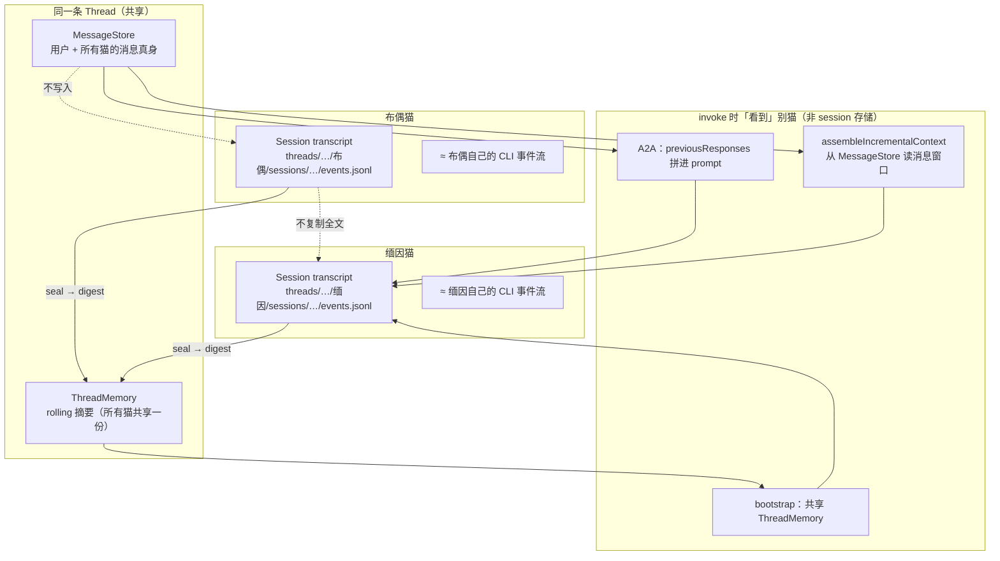
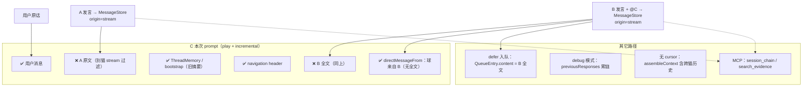

# 消息流转图（渐进迭代）

> **私人学习用。** 每次讨论只 **追加** 新版 mermaid，**不修改** 旧版图（除非你明确要求改旧图）。
> 主地图仍见 [`clowder-collab-map.md`](./clowder-collab-map.md)。

## 使用规矩

| 规矩 | 说明 |
|------|------|
| **只追加** | 新一节 = 新日期 + 新图 + 简短说明 |
| **不改旧图** | 保留每次迭代的痕迹；纠错用「勘误」小节文字说明，不重绘旧节 |
| **粒度** | 第一版求串概念；细节以后另开迭代 |

---

## 迭代 1 — 2026-08-11 · F300 全景（第一版）

**场景：** 你提需求「做 F300 消息草稿箱」，@布偶猫设计，布偶 @缅因猫审稿。  
**目的：** 串 Thread / Message / 路由 / 调度 / Invocation / A2A / 记忆注入 vs 检索。  
**刻意省略：** 公平门、KV 便签、Event Memory、七工具全集。

**两条记忆线：**

- **实线左支：** Message → MessageStore → invoke **直接读历史**（聊天记录传输）
- **虚线右支：** seal 后 → ThreadMemory + evidence（**编译型记忆**，以后可搜 / bootstrap 注入）

**10 个主干词：** Thread · Message · 路由 · 调度 · Invocation · A2A · 上下文注入 · Evidence · 主动检索 · Seal/摘要

---

## 迭代 2 — 2026-08-11 · Session seal 何时发生（答疑图）

**问题：** Session seal 是不是只有 A2A 结束后才做？  
**结论：** **不是。** seal 关的是 **某一只猫的一条 Session**（per-cat × per-thread 的 CLI 会话链），与「整次 invocation 结束」或「A2A 链跑完」**无固定绑定**。

**Seal 之后做什么（finalize）：** transcript 落盘 → handoff digest → **`buildThreadMemory`**（thread 摘要）→ 索引进 evidence。  
**代码锚点：** `SessionSealer.requestSeal` / `finalize` · `session-strategy.shouldTakeAction` · `invoke-single-cat`（mid-stream defer seal 在 `done` 边界执行）

---

## 迭代 3 — 2026-08-11 · 聊天记录存在哪？（per-cat Session 答疑）

**问题：** 每只猫的 session 会存其他猫的聊天记录吗？  
**结论：** **不会把别的猫的完整聊天抄进自己的 Session transcript。** 共享聊天在 **MessageStore（thread 级）**；Session 是 **per-cat 运行时审计链**；跨猫协作时，别的猫内容通过 **prompt 注入** 或 **共享 ThreadMemory** 进入视野，而不是写进「我的 session 文件夹」。

**对照表：**

| 存什么 | 粒度 | 含其他猫聊天？ |
|--------|------|----------------|
| **MessageStore** | thread | **是** — 全场聊天记录 |
| **Session transcript** | per-cat × session | **否** — 主要是本猫 invoke 事件 |
| **ThreadMemory** | thread | **是摘要** — 各猫 seal 后合并进同一份 thread 摘要 |
| **Evidence 索引** | 项目/thread | 可索引全场 passage，不是「塞进某猫 session 文件」 |

---

## 迭代 4 — 2026-08-11 · A→B→C 链：C 能看见 A 吗？

**问题：** A 交接 B，B 再交接 C，C 是否只能看「交给自己的摘要」，看不到 A 原文？  
**结论：** **默认 play + 增量上下文下，C 通常看不到 A 的原文，也看不到 B 的完整发言**（都落在 MessageStore，但被可见性规则挡在 prompt 外）。C 主要靠：**用户原话**、**ThreadMemory 旧摘要**、**「球来自 B」元数据**，以及猫主动 **MCP 读链/搜 evidence**。

| 路径 | C 能看到 A？ | C 能看到 B 全文？ |
|------|-------------|------------------|
| **inline A2A + play + incremental**（常见） | 一般 **不能** | 一般 **不能**（靠元数据 + 工具） |
| **defer 入队 A2A** | 仅 B 文中转述 | **能**（`entry.content`） |
| **debug 模式** | **能**（`previousResponses`） | **能** |
| **legacy assembleContext** | **能**（最近 N 条跨猫） | **能** |
| **seal 后 ThreadMemory** | 摘要级 | 摘要级（非同一 invocation 即时） |

**和 Session seal 的关系：** seal 产出 digest / ThreadMemory，**不是**「B 把 A 的摘要转交给 C」的专用机制；A2A 链内 C 的可见性主要由 **MessageStore + 增量上下文过滤** 决定。

---

## 修订记录

| 日期 | 迭代 | 说明 |
|------|------|------|
| 2026-08-11 | 1 | F300 全景第一版 |
| 2026-08-11 | 2 | Session seal 与 A2A 关系答疑 |
| 2026-08-11 | 3 | per-cat Session 是否含别猫聊天 |
| 2026-08-11 | 4 | A→B→C 上下文可见性 |
